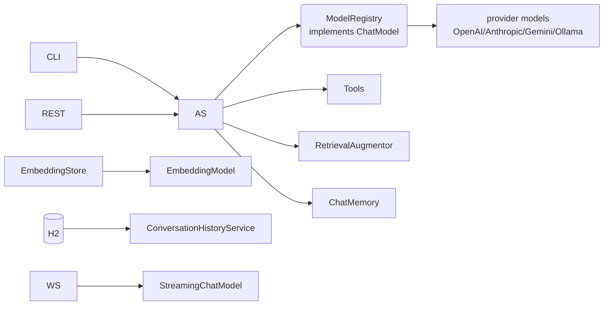

# 01 — App architecture

## Overview
A Spring Boot 4.1.0 demo that exercises LangChain4j 1.19.0 capabilities: chat with
memory, RAG over embedded documents, tool-using agents, an agentic crew, streaming,
multimodal, evaluation, and a multi-provider model registry. Everything the CLI can
do is also exposed over REST/SSE/WebSocket.

## Key concepts / API
- **One chat model bean**: `ModelRegistry` implements `ChatModel` and is the only
  `ChatModel` bean, so every AI service shares it (→ 04-model-registry.md).
- **AI services** (`AiServices.builder(...).build()`) are created as beans in
  `config/AiConfig.java` (→ 02-ai-services.md).
- **Entry points**: `ChatCli` (CommandLineRunner), REST controllers under `api/`,
  and a WebSocket handler (→ 27-web-layer.md).
- **Storage**: in-process `ChatMemory` per conversation id, an
  `InMemoryEmbeddingStore` persisted to `embedding-store.json`, and an H2 database
  (JPA) for conversation history (→ 12-memory-registry-history.md).
- **Config**: everything is `app.*` properties in `application.properties`.

## Code snippet — the wiring map
```text
config/AiConfig.java  -> streamingChatModel, streamingAgent, assistant,
                         contentRetriever, retrievalAugmentor, qaAssistant,
                         agent, dynamicAgent, imageModel, audioTranscriptionModel,
                         fewShotAssistant, movieExtractor, topicExtractor,
                         embeddingModelFactory
```

## Diagram


## Lessons learned / gotchas
- Exposing the app's models as `app.*` properties (not hard-coded) made every
  capability switchable and testable.
- The streaming chat model is a **separate bean** from `ModelRegistry` because the
  registry only covers the synchronous `ChatModel` interface.
- `ChatCli` is disabled in tests via `app.cli.enabled=false`; otherwise the
  context blocks on stdin.
- The BOM (`langchain4j-bom`) pins all module versions; the experimental
  `langchain4j-agentic` module uses its own `-betaNN` version.

## Related files
- `src/main/java/dev/prasadgaikwad/langchain4jdemo/**` — packages map 1:1 to
  capabilities (`agent`, `agentic`, `ai`, `chain`, `config`, `db`, `document`,
  `embedding`, `evaluation`, `llm`, `memory`, `multimodal`, `prompt`, `rag`,
  `streaming`, `structured`, `ws`, `api`).
- `pom.xml`, `src/main/resources/application.properties`,
  `src/main/resources/static/index.html` (feature summary page).

## References
- https://docs.langchain4j.dev/ — official docs homepage
- https://docs.langchain4j.dev/integrations/frameworks/spring-boot — Spring Boot integration
