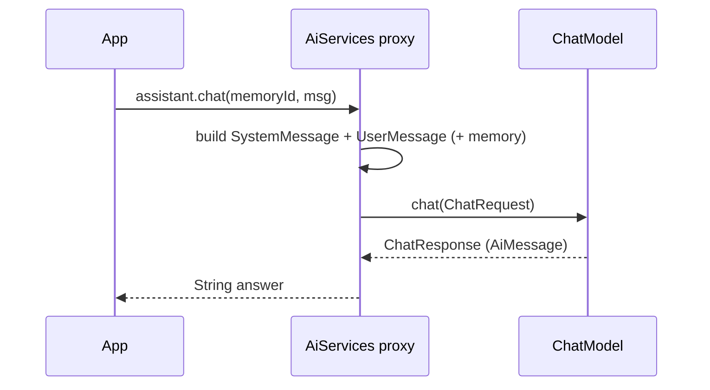

# 02 — AI Services

## Overview
AI Services are LangChain4j's high-level abstraction (like Spring Data JPA or
Retrofit): you declare a Java interface, `AiServices` builds a **proxy** that
formats the input, calls the LLM, parses the output, and wires in memory, tools,
and RAG.

## Key concepts / API
- `AiServices.create(Assistant.class, model)` — simplest factory.
- `AiServices.builder(Assistant.class).chatModel(...).chatMemoryProvider(...)` —
  full control (tools, retriever, etc.).
- Annotations: `@SystemMessage`, `@UserMessage`, `@MemoryId`, `@V` (→ 06, 11).
- Return types: `String`, enums, POJOs/records, `List<T>`, or `Result<T>` for
  extra metadata (→ 08, 09, 10).
- In Spring Boot the `@Bean` factory methods in `AiConfig` build the proxies, so
  you just inject the interface.

## Code snippet
```java
public interface Assistant {
    @SystemMessage("You are a helpful assistant. Answer in 2 sentences maximum.")
    String chat(@MemoryId String memoryId, @UserMessage String message);
}

// in AiConfig
@Bean
public Assistant assistant(ChatModel chatModel, ChatMemoryProvider provider) {
    return AiServices.builder(Assistant.class)
            .chatModel(chatModel)
            .chatMemoryProvider(provider)
            .build();
}
```

## Diagram


## Lessons learned / gotchas
- A method **without** a `@MemoryId` parameter uses the memory id `"default"`.
- AI services must not be called concurrently for the same `@MemoryId` —
  LangChain4j has no locking, concurrent calls can corrupt memory.
- Interfaces make services mockable in unit tests, and each AI service can be
  integration-tested in isolation.
- `AiServices` retains the `ChatMemory` instances itself; expose them via a
  registry to inspect/clear them from outside (→ 12-memory-registry-history.md).

## Related files
- `ai/Assistant.java`, `ai/QaAssistant.java`, `ai/Agent.java`,
  `ai/DynamicAgent.java`, `prompt/FewShotAssistant.java`,
  `prompt/MovieExtractor.java`, `prompt/TopicExtractor.java`,
  `streaming/StreamingAgent.java`, `config/AiConfig.java`.

## References
- https://docs.langchain4j.dev/tutorials/ai-services — AI Services
