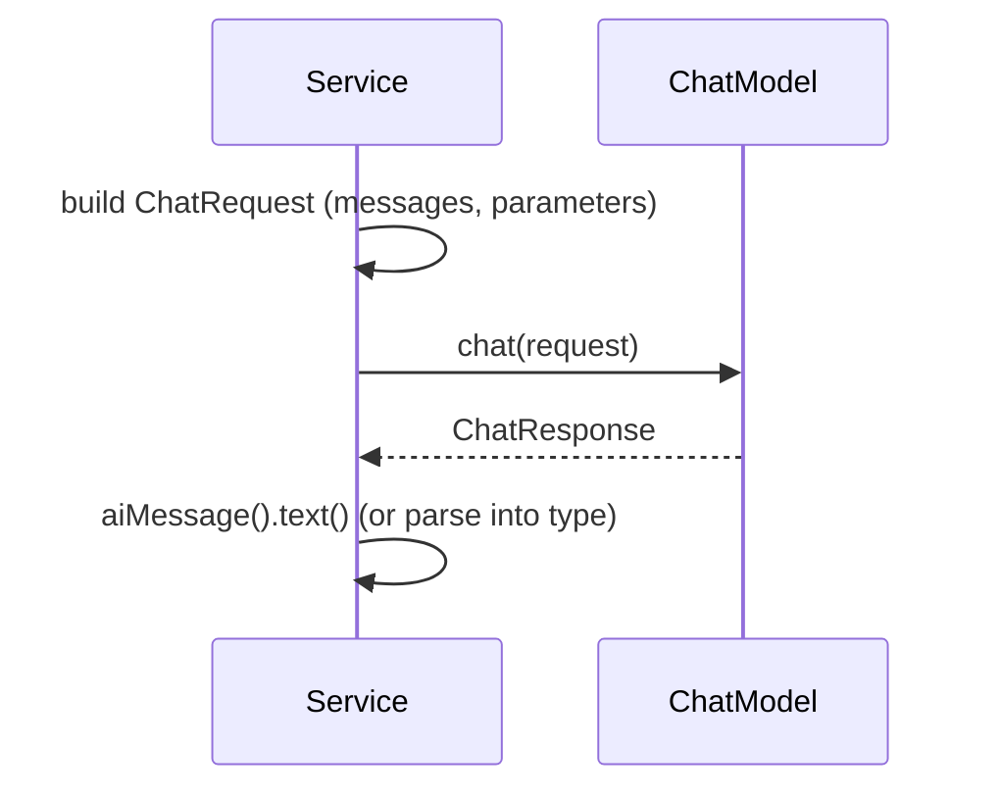

# 03 — Chat request / response pipeline

## Overview
The low-level API that AI services use under the hood: build a `ChatRequest`
(messages + optional parameters), call `ChatModel.chat(...)`, read the
`ChatResponse`. Knowing this layer is essential for streaming, structured output,
and writing fake models for tests.

## Key concepts / API
- `ChatModel` (synchronous), `StreamingChatModel` (→ 26).
- `ChatRequest` — built with `ChatRequest.builder().messages(...)`,
  `.parameters(...)`, `.responseFormat(...)` (→ 10).
- `ChatRequestParameters` — per-call parameters (temperature, response format,
  etc.).
- `ChatMessage` subtypes: `SystemMessage`, `UserMessage`, `AiMessage`,
  `ToolExecutionResultMessage`.
- `ChatResponse.builder().aiMessage(AiMessage.from(text))` — the shape fakes
  return (→ 34).

## Code snippet
```java
ChatResponse response = chatModel.chat(ChatRequest.builder()
        .messages(List.of(
                SystemMessage.from("You are a movie critic."),
                UserMessage.from("Review Inception.")))
        .build());
String answer = response.aiMessage().text();
```

## Diagram


## Lessons learned / gotchas
- Providers return provider-specific parameter types (e.g.
  `OpenAiChatRequestParameters`); merging in a facade requires delegating
  `defaultRequestParameters()` to the wrapped model or the cast breaks (→ 04).
- JSON schema / response format is attached to the request via
  `ChatRequestParameters.builder().responseFormat(...)` (→ 10).
- `FakeChatModel.doChat(request)` simply records the request and returns a canned
  `ChatResponse`, which is how we assert on the prompt built by AI services.

## Related files
- `llm/ModelRegistry.java`, `structured/JsonSchemaExtractionService.java`,
  `streaming/ChatStreamingService.java`,
  `src/test/java/dev/prasadgaikwad/langchain4jdemo/FakeChatModel.java`.

## References
- https://docs.langchain4j.dev/tutorials/chat-and-language-models — Chat and language models
- https://docs.langchain4j.dev/tutorials/model-parameters — Model parameters
