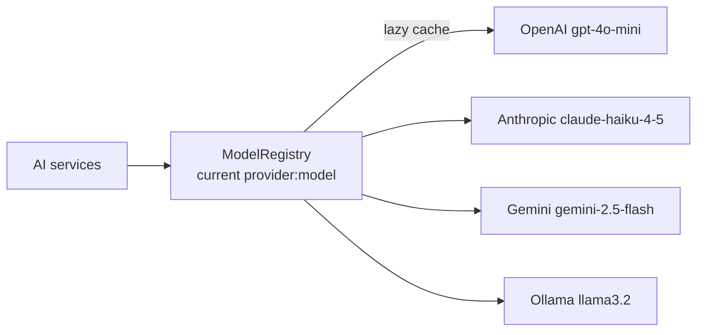

# 04 — ModelRegistry: multi-provider runtime switching

## Overview
`ModelRegistry` implements `ChatModel` and is the **single** chat model bean in
the app. Switching its `provider:model` selection switches every AI service
(assistant, RAG, agent, judge, crew) at runtime — no restarts.

## Key concepts / API
- Implements `ChatModel`: `doChat`, `defaultRequestParameters`,
  `supportedCapabilities`, `listeners`, `provider` all delegate to the
  currently selected provider model.
- Models are **lazy** (built on first use) and cached per `provider:model`, so
  startup never requires API keys for all providers.
- `LlmProvider` enum: OPENAI / ANTHROPIC / GEMINI / OLLAMA with default models.
- `availableModels()` exposes only providers whose env key is present (Ollama
  always, it's local).
- CLI: `/model chat anthropic`, `/model gemini:gemini-2.5-flash`, `/model ollama`.

## Code snippet
```java
@Override
public ChatResponse doChat(ChatRequest request) {
    return currentChatModel().doChat(request);
}

@Override
public ChatRequestParameters defaultRequestParameters() {
    return currentChatModel().defaultRequestParameters();  // crucial
}

private ChatModel buildChatModel(LlmProvider provider, String modelName) {
    return switch (provider) {
        case OPENAI    -> OpenAiChatModel.builder().apiKey(env("OPENAI_API_KEY")).modelName(modelName).build();
        case ANTHROPIC -> AnthropicChatModel.builder().apiKey(env("ANTHROPIC_API_KEY")).modelName(modelName).build();
        case GEMINI    -> GoogleAiGeminiChatModel.builder().apiKey(env("GOOGLE_AI_GEMINI_API_KEY")).modelName(modelName).build();
        case OLLAMA    -> OllamaChatModel.builder().baseUrl(ollamaBaseUrl).modelName(modelName).build();
    };
}
```

## Diagram


## Lessons learned / gotchas
- **Gotcha (real bug):** the `ChatModel` interface's default
  `defaultRequestParameters()` returns `DefaultChatRequestParameters`, which
  provider models cannot process — `OpenAiChatModel.doChat` casts the merged
  parameters to `OpenAiChatRequestParameters`. If the facade does not delegate,
  requests crash. Always override it to delegate to the current model.
- `availableModels()` is overridden in tests with a fixed list so evaluation is
  independent of environment keys.
- Embedding models are switched separately via an `EmbeddingModel` factory bean
  (`Function<String, EmbeddingModel>`) (→ 15).

## Related files
- `llm/ModelRegistry.java`, `llm/LlmProvider.java`, `config/AiConfig.java`,
  `ChatCli.java` (`/model`), `src/test/java/dev/prasadgaikwad/langchain4jdemo/llm/*`.

## References
- https://docs.langchain4j.dev/integrations/language-models — Supported chat models
- https://docs.langchain4j.dev/tutorials/chat-and-language-models
