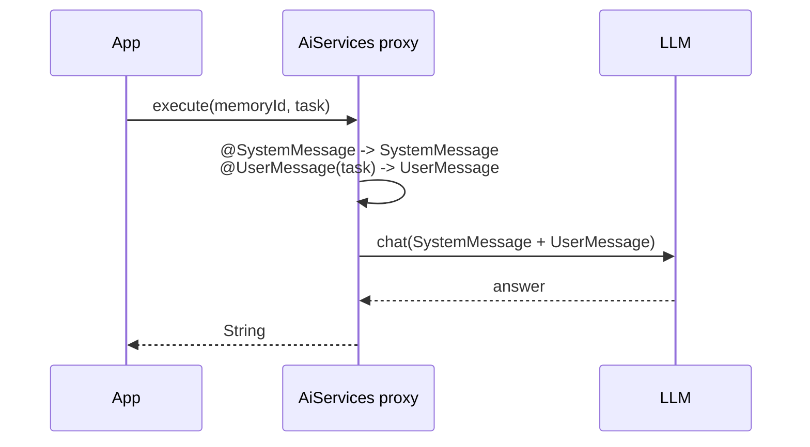

# 06 — Prompt annotations on AI service interfaces

## Overview
`@SystemMessage` and `@UserMessage` on an AI service interface method declare the
prompt declaratively. LangChain4j converts them into messages, substituting
`{{variables}}`, before each call. `@MemoryId` marks the parameter that selects
conversation memory (→ 11).

## Key concepts / API
- `@SystemMessage("...")` → `SystemMessage`; may also use `fromResource`.
- `@UserMessage("... {{it}} ...")` → `UserMessage`; `{{it}}` is the single method
  argument.
- `@V("name")` names a template variable explicitly (needed without `-parameters`).
- Interface-level `@SystemMessage` applies to all methods; method-level wins.
- `@MemoryId` — parameter selecting per-conversation `ChatMemory`.

## Code snippet
```java
public interface Agent {
    @SystemMessage("""
            You are an agent that accomplishes the user's task using the available tools.
            Use the "searchDocuments" tool when the task asks about the indexed documents.
            If the task does not need a tool, answer directly. Be concise.
            """)
    String execute(@MemoryId String memoryId, @UserMessage String task);
}
```

## Diagram


## Lessons learned / gotchas
- Template variables only work when the parameter is annotated `@V` (or the
  compiler keeps parameter names). In Spring Boot `-parameters` is enabled, so
  `@V` is optional — but we keep it for clarity in sub-agent contracts (→ 24).
- A method `@SystemMessage` overrides an interface-level one.
- Keep prompts concise and explicit about when to use tools; models follow the
  instruction list better when it is short.

## Related files
- `ai/Assistant.java`, `ai/QaAssistant.java`, `ai/Agent.java`,
  `ai/DynamicAgent.java`, `prompt/FewShotAssistant.java`,
  `prompt/MovieExtractor.java`, `prompt/TopicExtractor.java`,
  `agentic/CrewTaskAgent.java`.

## References
- https://docs.langchain4j.dev/tutorials/ai-services — `@SystemMessage` / `@UserMessage` / `@V`
