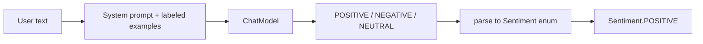

# 07 — Few-shot prompting

## Overview
Give the model a handful of labeled examples *in the prompt* so it learns the
expected output format and decision boundaries. `FewShotAssistant` classifies text
into `Sentiment` using examples embedded in the system message.

## Key concepts / API
- Few-shot = zero-shot + a few `text → label` examples in the system message.
- The `Sentiment` **enum return type** acts as the output parser (→ 08).
- Useful when you want cheap, deterministic-ish classification without fine-tuning.

## Code snippet
```java
public interface FewShotAssistant {
    @SystemMessage("""
            You are a sentiment classifier. Classify the sentiment of the given text
            as one of: POSITIVE, NEGATIVE, NEUTRAL. Reply with exactly one of these words.

            Examples:
            Text: "I absolutely loved this movie, best film of the year!"
            Sentiment: POSITIVE

            Text: "This restaurant is terrible, the food was cold."
            Sentiment: NEGATIVE
            """)
    Sentiment classify(@UserMessage String text);
}
```

## Diagram


## Lessons learned / gotchas
- Examples must cover **all** possible labels and be representative of real input.
- Keep the number of examples small; each one consumes prompt tokens.
- Combined with an enum return type, parsing is handled by LangChain4j — the
  model is constrained to emit one of the enum values.

## Related files
- `prompt/FewShotAssistant.java`, `prompt/Sentiment.java`,
  `config/AiConfig.java`, `api/PromptApiController.java` (`/sentiment`).

## References
- https://docs.langchain4j.dev/tutorials/classification — Classification tutorial
- https://docs.langchain4j.dev/tutorials/structured-outputs — enum return types
