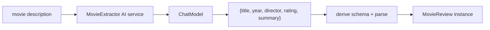

# 09 — Structured output: record + output parser

## Overview
Returning a **POJO/record** (here `MovieReview`) from an AI service makes
LangChain4j request JSON matching the type's schema and parse the reply into an
instance. The return type *is* the output parser.

## Key concepts / API
- Method return type = record/class → LangChain4j derives a JSON schema, asks the
  model for JSON, and parses it with Jackson.
- Field descriptions help the LLM: use `@Description` or (in this demo) OpenAPI
  `@Schema` annotations on fields.
- `MovieExtractor` declares the shape; `MovieReview` is the data type.

## Code snippet
```java
public record MovieReview(
        String title,
        int year,
        String director,
        double rating,
        String summary) {}

public interface MovieExtractor {
    @SystemMessage("""
            Extract information about the movie from the given text.
            Return the data as a JSON object with exactly these fields:
            title (string), year (integer), director (string),
            rating (number from 1 to 10), summary (string).
            """)
    MovieReview extract(@UserMessage String text);
}
```

## Diagram


## Lessons learned / gotchas
- The **system message must describe the JSON shape**; the record type drives
  schema + parsing.
- By default fields are optional in AI-service JSON Schema mode; use
  `@JsonProperty(required = true)` when a field must be present (see official
  docs).
- This "prompting + parse" approach is less reliable than JSON Schema mode (→ 10);
  prefer JSON Schema when the provider supports it.

## Related files
- `prompt/MovieExtractor.java`, `prompt/MovieReview.java`,
  `config/AiConfig.java`, `api/PromptApiController.java` (`/movie`), `ChatCli.java`.

## References
- https://docs.langchain4j.dev/tutorials/structured-outputs — POJO return types
