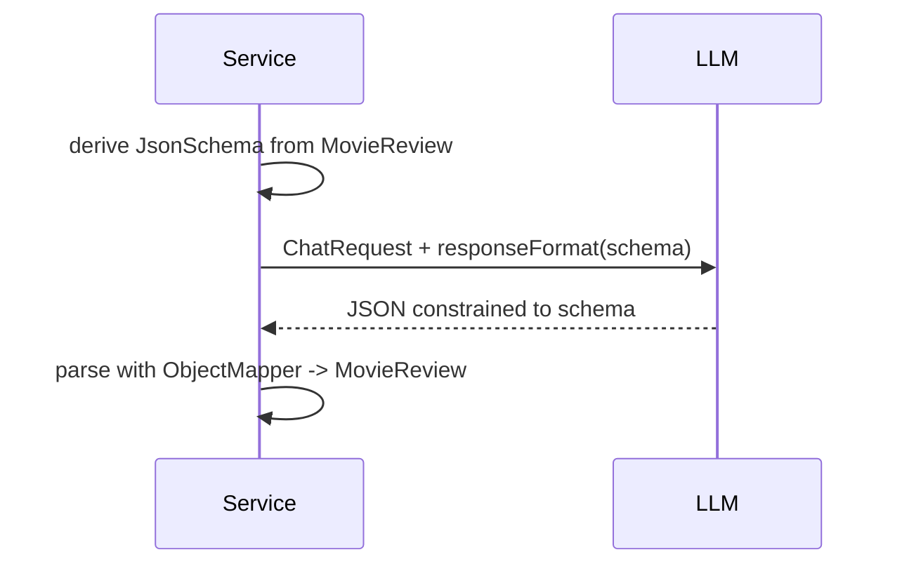

# 10 — Structured output: JSON Schema response format

## Overview
`JsonSchemaExtractionService` constrains the model at the **request level**: it
derives a JSON schema from a record and attaches it as the response format, so the
model is forced to emit exactly that shape. This is the most reliable structured
output approach (provider support: OpenAI, Azure OpenAI, Gemini, Mistral, Ollama,
Bedrock).

## Key concepts / API
- `JsonSchemas.jsonSchemaFrom(MovieReview.class)` → `Optional<JsonSchema>`.
- `ChatRequestParameters.builder().responseFormat(schema)` — attaches the schema
  to the request.
- Reply is parsed with a Jackson `ObjectMapper`.
- Contrast with `MovieExtractor` (→ 09) which relies on prompting + parsing.

## Code snippet
```java
JsonSchema schema = JsonSchemas.jsonSchemaFrom(MovieReview.class)
        .orElseThrow(() -> new IllegalStateException("No JSON schema derivable from MovieReview"));

String reply = chatModel.chat(ChatRequest.builder()
        .messages(List.of(
                SystemMessage.from(SYSTEM_PROMPT),
                UserMessage.from(text)))
        .parameters(ChatRequestParameters.builder()
                .responseFormat(schema)
                .build())
        .build())
        .aiMessage().text();

return objectMapper.readValue(reply, MovieReview.class);
```

## Diagram


## Lessons learned / gotchas
- JSON schema is passed in a **dedicated request attribute**; no prompt
  instructions needed (though a short system prompt helps).
- When using the AI-service API for the same feature you must enable JSON Schema
  support on the model builder (e.g. OpenAI: `supportedCapabilities(RESPONSE_FORMAT_JSON_SCHEMA)`
  and `strictJsonSchema(true)`).
- Does **not** work in streaming mode for OpenAI.
- Always fail loudly when the model reply is not parseable so the shape problem is
  visible (`IllegalArgumentException` with the raw reply).

## Related files
- `structured/JsonSchemaExtractionService.java`, `prompt/MovieReview.java`,
  `ChatCli.java` (`/schema`).

## References
- https://docs.langchain4j.dev/tutorials/structured-outputs — JSON Schema section
