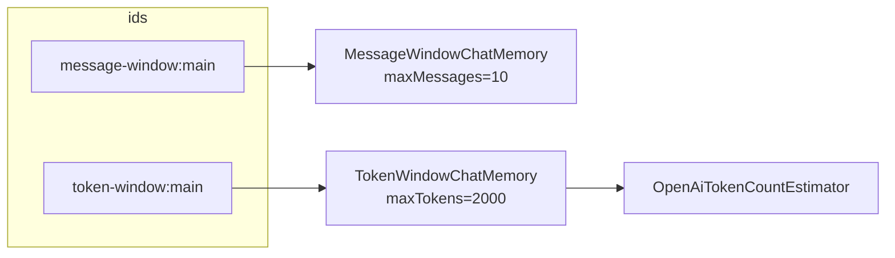

# 11 — Memory types

## Overview
`MemoryType` supports two `ChatMemory` strategies: **message-window** (sliding
window by message count) and **token-window** (by token count, context-aware).
The type is embedded in the memory id so switching types starts a fresh memory of
the new type.

## Key concepts / API
- `MessageWindowChatMemory.builder().id(id).maxMessages(n).build()` — buffer
  limited by message count.
- `TokenWindowChatMemory.builder().id(id).maxTokens(n, tokenCountEstimator).build()`
  — sliding window limited by tokens; needs a `TokenCountEstimator`
  (e.g. `OpenAiTokenCountEstimator(modelName)`).
- `ChatMemoryProvider` supplies a `ChatMemory` per memory id; `@MemoryId` selects
  which conversation (→ 02).
- `MemoryType.memoryId(conversationId)` → e.g. `message-window:main`,
  `token-window:main`.

## Code snippet
```java
// AiConfig
private ChatMemory createMemory(String memoryId, String modelName,
                                int maxMessages, int maxTokens) {
    if (memoryId.startsWith(MemoryType.MESSAGE_WINDOW.label())) {
        return MessageWindowChatMemory.builder()
                .id(memoryId).maxMessages(maxMessages).build();
    }
    return TokenWindowChatMemory.builder()
            .id(memoryId)
            .maxTokens(maxTokens, new OpenAiTokenCountEstimator(modelName))
            .build();
}
```

## Diagram


## Lessons learned / gotchas
- The id scheme (`label:conversationId`) keeps the two memory types isolated —
  switching type does not accidentally share history.
- Token-window memory requires a token-count estimator; pass the model name so
  tokenization matches the model in use.
- CLI: `/memory message-window|token-window`, `/memory`, `/clear` operate on the
  current type.

## Related files
- `memory/MemoryType.java`, `config/AiConfig.java`, `ChatCli.java`,
  `src/test/java/dev/prasadgaikwad/langchain4jdemo/memory/*`.

## References
- https://docs.langchain4j.dev/tutorials/chat-memory — Chat memory tutorial
