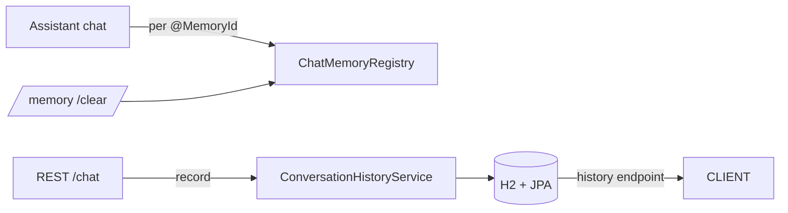

# 12 — Memory registry & database-backed history

## Overview
Two complementary kinds of history:
1. **In-process chat memory** (LangChain4j `ChatMemory`), which `AiServices`
   retains itself — exposed via `ChatMemoryRegistry` so the CLI can inspect/clear
   it.
2. **Persistent history** (H2 + Spring Data JPA) via `ConversationHistoryService`,
   which survives restarts and is exposed over REST.

## Key concepts / API
- `ChatMemoryRegistry` — `ConcurrentHashMap<String, ChatMemory>`; the
  `ChatMemoryProvider` registers each memory as it is created.
- `ConversationEntry` / `ConversationEntryRepository` (JPA) — `conversationId`,
  `role`, `text`, `timestamp`.
- `ConversationHistoryService.record(...)`, `history(id)`, `conversationIds()`,
  `clear(id)` — all `@Transactional`.
- REST: `GET /api/history`, `GET /api/history/{id}`, `DELETE /api/history/{id}`.

## Code snippet
```java
// AiConfig: register every created memory
ChatMemoryProvider provider = memoryId -> {
    ChatMemory memory = createMemory((String) memoryId, modelName, maxMessages, maxTokens);
    chatMemoryRegistry.register((String) memoryId, memory);
    return memory;
};

// ChatApiController: persist each turn
String answer = assistant.chat(request.conversationId(), request.message());
historyService.record(request.conversationId(), "user", request.message());
historyService.record(request.conversationId(), "ai", answer);
```

## Diagram


## Lessons learned / gotchas
- `ChatMemory` is ephemeral; JPA history is durable. They serve different needs.
- Registering memories at creation time is the only way to reach them, because
  `AiServices` holds them internally.
- The REST conversation-history fix (issue in the docs review) centered on making
  the chat/ask/agent endpoints record every turn — don't forget the streaming
  endpoint, which records on completion.

## Related files
- `memory/ChatMemoryRegistry.java`, `db/ConversationHistoryService.java`,
  `db/ConversationEntry.java`, `db/ConversationEntryRepository.java`,
  `api/HistoryApiController.java`, `api/ChatApiController.java`,
  `application.properties` (H2 config).

## References
- https://docs.langchain4j.dev/tutorials/chat-memory — ChatMemory and ChatMemoryProvider
