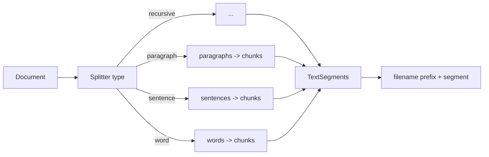

# 14 — Document splitters

## Overview
After parsing, documents are split into `TextSegment`s. `DocumentSplitterType`
wraps the LangChain4j splitter implementations and exposes a switchable strategy:
recursive, paragraph, line, sentence, word, or character. Chunk size and overlap
are configurable; each segment is prefixed with its source file name to improve
retrieval quality.

## Key concepts / API
- `DocumentSplitter` implementations: `DocumentByParagraphSplitter`,
  `DocumentByLineSplitter`, `DocumentBySentenceSplitter`, `DocumentByWordSplitter`,
  `DocumentByCharacterSplitter`, and `DocumentSplitters.recursive(...)`.
- Constructed with `(maxChunkSize, maxOverlap)` — chars in this demo.
- Splitters combine small units into chunks and call a **sub-splitter** for units
  too large to fit; metadata (incl. a unique `index`) is copied to each segment.
- The demo prefixes `FILE_NAME + "\n"` to each segment so the model can attribute
  answers.

## Code snippet
```java
public DocumentSplitter create(int maxChunkSize, int maxOverlap) {
    return switch (this) {
        case RECURSIVE  -> DocumentSplitters.recursive(maxChunkSize, maxOverlap);
        case PARAGRAPH  -> new DocumentByParagraphSplitter(maxChunkSize, maxOverlap);
        case LINE       -> new DocumentByLineSplitter(maxChunkSize, maxOverlap);
        case SENTENCE   -> new DocumentBySentenceSplitter(maxChunkSize, maxOverlap);
        case WORD       -> new DocumentByWordSplitter(maxChunkSize, maxOverlap);
        case CHARACTER  -> new DocumentByCharacterSplitter(maxChunkSize, maxOverlap);
    };
}
```

## Diagram


## Lessons learned / gotchas
- The filename prefix is a cheap, effective retrieval-quality win — the model sees
  *where* the text came from.
- Chunk size/overlap defaults (`200/20` chars) work for short sample docs; real
  RAG usually chunks by **tokens** (e.g. `DocumentSplitters.recursive(1000, 200,
  tokenCountEstimator)`).
- Splitter choice matters: paragraphs keep context, sentences are more precise.
- CLI: `/splitter <type>`; re-index after switching so existing chunks are
  re-split with the new strategy.

## Related files
- `document/DocumentSplitterType.java`, `document/DocumentService.java`,
  `application.properties` (`app.document.*`), `ChatCli.java` (`/splitter`).

## References
- https://docs.langchain4j.dev/tutorials/rag — Document splitter section
