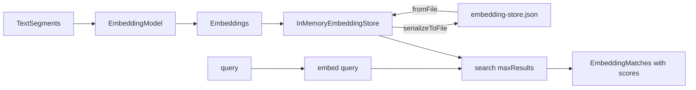

# 15 — Embeddings & vector store

## Overview
`SemanticSearchService` embeds `TextSegment`s with a configurable `EmbeddingModel`,
stores them in an `InMemoryEmbeddingStore` (persisted to a JSON file), and searches
by cosine similarity. The embedding model can be switched at runtime.

## Key concepts / API
- `EmbeddingModel` — `embed(text)`, `embedAll(segments)`; built by a
  `Function<String, EmbeddingModel>` factory bean so it can be switched.
- `InMemoryEmbeddingStore<TextSegment>` — `addAll(embeddings, segments)`,
  `search(EmbeddingSearchRequest)`, `serializeToFile`, `fromFile`, `size()`.
- `EmbeddingSearchRequest.builder().queryEmbedding(q).maxResults(n).build()` →
  `EmbeddingMatch` list with `score()` and `embedded()`.
- Search flow: embed the query, then similarity-search the store.

## Code snippet
```java
// indexing
List<Embedding> embeddings = embeddingModel.embedAll(segments).content();
embeddingStore.addAll(embeddings, segments);

// search
Response<Embedding> q = embeddingModel.embed(query);
List<EmbeddingMatch<TextSegment>> matches = embeddingStore.search(
        EmbeddingSearchRequest.builder()
                .queryEmbedding(q.content())
                .maxResults(maxResults)
                .build()).matches();
```

## Diagram


## Lessons learned / gotchas
- Persisting the store to JSON means re-indexing is not needed across restarts —
  but embeddings are model-specific: **switching the embedding model requires
  re-indexing**.
- `minScore` filtering is available but the demo relies on `maxResults`.
- The store returns scores in `[0,1]`; the RAG retriever passes them through as
  metadata (→ 16).
- A package-private constructor (injecting the factory/`EmbeddingModel` directly)
  allows fully offline unit tests.

## Related files
- `embedding/SemanticSearchService.java`, `config/AiConfig.java`
  (`embeddingModelFactory`), `application.properties` (`app.embedding.*`),
  `api/EmbeddingApiController.java`, `ChatCli.java` (`/index`, `/search`, `/save`,
  `/store`).

## References
- https://docs.langchain4j.dev/tutorials/rag — Embedding model & store section
- https://docs.langchain4j.dev/tutorials/embedding-stores — Embedding (vector) stores tutorial
