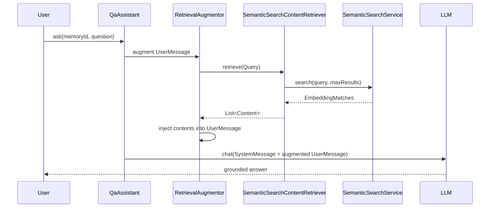

# 16 — RAG pipeline

## Overview
RAG = retrieve relevant chunks for a question, inject them into the user message,
then let the model answer from your own data. `RetrievalAugmentor` orchestrates
the pipeline; this demo plugs in a custom `ContentRetriever` that delegates to the
project's `SemanticSearchService`.

## Key concepts / API
- `DefaultRetrievalAugmentor.builder().contentRetriever(...).build()` — the
  out-of-the-box pipeline.
- `ContentRetriever.retrieve(Query)` → `List<Content>`; the bridge
  `SemanticSearchContentRetriever` calls `SemanticSearchService.search(...)` and
  wraps matches in `Content` with score metadata.
- `QaAssistant` — AI service wired with `.retrievalAugmentor(...)`; its system
  message instructs "answer only from provided context, else 'I don't know'".
- `QaService` — thin facade over `QaAssistant`.
- Advanced components: `QueryTransformer`, `QueryRouter`, `ContentAggregator`,
  `ContentInjector` (not used here, but part of `DefaultRetrievalAugmentor`).

## Code snippet
```java
// config
@Bean
public ContentRetriever contentRetriever(SemanticSearchService searchService,
                                         @Value("${app.rag.max-results:5}") int maxResults) {
    return new SemanticSearchContentRetriever(searchService, maxResults);
}

@Bean
public RetrievalAugmentor retrievalAugmentor(ContentRetriever contentRetriever) {
    return DefaultRetrievalAugmentor.builder()
            .contentRetriever(contentRetriever)
            .build();
}
```

## Diagram


## Lessons learned / gotchas
- The retriever **always** uses the currently selected embedding model/store,
  because it delegates at retrieval time instead of capturing references.
- `Content.from(segment, Map.of(ContentMetadata.SCORE, score))` preserves scores
  as metadata for transparency.
- The QaAssistant system prompt must forbid answering from general knowledge
  ("answer only from provided context") — otherwise the model hallucinates.
- RAG as a tool (retrieve only when the model decides) is an alternative pattern —
  documented in the official RAG tutorial.

## Related files
- `rag/QaService.java`, `rag/SemanticSearchContentRetriever.java`,
  `ai/QaAssistant.java`, `config/AiConfig.java`, `application.properties`
  (`app.rag.max-results`).

## References
- https://docs.langchain4j.dev/tutorials/rag — RAG tutorial (indexing/retrieval, advanced RAG)
