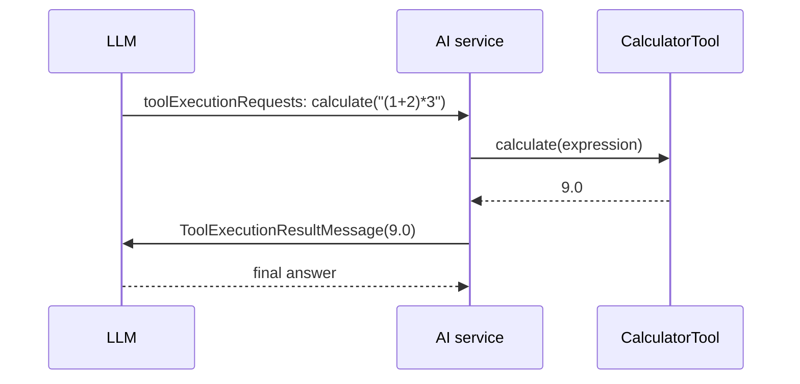

# 17 — Tool basics (`@Tool` + `@P`)

## Overview
Function calling lets the LLM request execution of registered Java methods.
`@Tool` turns a method into a tool specification; `@P` describes each parameter so
the model can fill it in correctly. `CalculatorTool` is the minimal example.

## Key concepts / API
- `@Tool("description")` — becomes the tool's name (method name) + description.
- `@P("description")` / `@P(name=..., value=...)` — parameter descriptions the
  model sees.
- Register tools at build time: `AiServices.builder(...).tools(calcTool, ...)`.
- The model decides *when* to call a tool; LangChain4j executes it and feeds the
  result back into the conversation (→ 21).
- `ToolService.findTools(object)` — discover `@Tool` methods programmatically
  (used by → 20).

## Code snippet
```java
@Component
public class CalculatorTool {

    @Tool("Calculates the result of an arithmetic expression using +, -, *, / and parentheses")
    public double calculate(
            @P("The arithmetic expression to evaluate, e.g. \"(1 + 2) * 3\"") String expression) {
        return new Evaluator(expression).evaluate();
    }
}
```

## Diagram


## Lessons learned / gotchas
- A good tool **description and parameter descriptions** are what make the model
  call it correctly — mirror the "if a human can understand it, the LLM can too"
  rule.
- Arithmetic in the demo is also short-circuited deterministically in the chain
  (→ 22) so the model isn't even invoked for pure math.
- Tools can be static or instance methods, any visibility, and can return any type
  (non-String returns are JSON-serialized back to the model).

## Related files
- `agent/CalculatorTool.java`, `config/AiConfig.java`, `ai/Agent.java`,
  `src/test/java/dev/prasadgaikwad/langchain4jdemo/agent/*`.

## References
- https://docs.langchain4j.dev/tutorials/tools — Tools (function calling) tutorial
