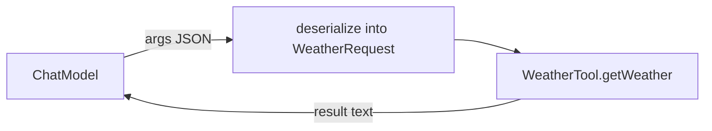

# 18 — Structured tool parameters

## Overview
Tool parameters can be a **record** with nested fields and enums. LangChain4j
derives the object schema from the type, so the model fills in a JSON object.
`WeatherTool` demonstrates a `WeatherRequest` record (city + unit enum) with
`@Description` guidance.

## Key concepts / API
- Tool method takes a record/POJO parameter → nested object schema.
- Enum fields become enum values the model must choose from.
- `@Description` on the record/fields guides the model (like `@P` on scalar
  params).
- When schema is satisfied, LangChain4j deserializes the JSON arguments into the
  record before invoking the method.

## Code snippet
```java
@Component
public class WeatherTool {

    @Description("Weather request parameters")
    public record WeatherRequest(String city, TemperatureUnit unit) {}

    public enum TemperatureUnit { CELSIUS("celsius"), FAHRENHEIT("fahrenheit") }

    @Tool("Gets the current temperature for a city, returning it in the requested unit")
    public String getWeather(WeatherRequest request) {
        // request.city(), request.unit() -> typed!
    }
}
```

## Diagram


## Lessons learned / gotchas
- All record fields are **required** by default for tools (unlike structured
  outputs) — the schema lists them in `required`.
- `@Description` on enum *values* is ignored (not included in the schema).
- Throw `IllegalArgumentException` from the tool for bad input (unknown city) so
  the model sees a meaningful error and can recover.
- This structured-parameter pattern scales to deeply nested POJOs.

## Related files
- `agent/WeatherTool.java`, `agent/DynamicToolProvider.java` (→ 20),
  `agentic/CrewService.java`.

## References
- https://docs.langchain4j.dev/tutorials/tools — Tool method parameters section
