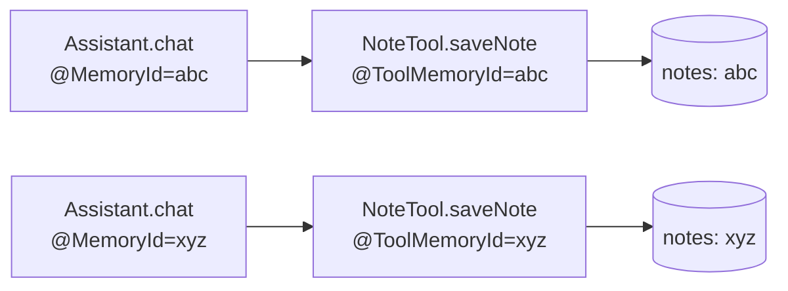

# 19 — Stateful tools scoped by conversation

## Overview
`NoteTool` keeps per-conversation state. `@ToolMemoryId` injects the current
conversation's memory id into the tool call, so notes are scoped to one
conversation and never leak into another — even though the tool bean is a shared
singleton.

## Key concepts / API
- `@ToolMemoryId` parameter on a `@Tool` method receives the same value as the
  AI service's `@MemoryId` parameter.
- Use a `ConcurrentHashMap<String, List<String>>` keyed by memory id for state.
- `ToolService.findTools(...)` can still discover these tools for dynamic
  providers (→ 20).

## Code snippet
```java
@Component
public class NoteTool {

    private final Map<String, List<String>> notesByConversation = new ConcurrentHashMap<>();

    @Tool("Saves a note for the current conversation")
    public String saveNote(@ToolMemoryId String memoryId,
                           @P("The note text to save") String note) {
        notesByConversation.computeIfAbsent(memoryId, k -> new ArrayList<>()).add(note);
        return "Note saved for conversation " + memoryId + ".";
    }
}
```

## Diagram


## Lessons learned / gotchas
- Without `@ToolMemoryId`, a singleton tool bean would share state across all
  conversations — a classic multi-tenant leak.
- The injected value matches the AI service method's `@MemoryId` argument exactly.
- `ConcurrentHashMap` keeps the tool safe when parallel tool execution is enabled.
- This is the pattern to copy for any per-user/per-chat tool state (preferences,
  caches, drafts).

## Related files
- `agent/NoteTool.java`, `ai/DynamicAgent.java`, `agent/DynamicToolProvider.java`,
  `src/test/java/dev/prasadgaikwad/langchain4jdemo/agent/*`.

## References
- https://docs.langchain4j.dev/tutorials/tools — `@ToolMemoryId` section
