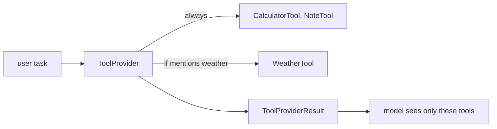

# 20 — Dynamic tool selection (ToolProvider)

## Overview
`DynamicToolProvider` decides **per request** which tools the model sees. Instead
of a fixed build-time set, the provider inspects the user message and exposes a
relevant subset — keeping the prompt small and reducing tool misuse. It uses
`AiServiceTool` entries discovered from tool beans.

## Key concepts / API
- `ToolProvider.provideTools(ToolProviderRequest)` → `ToolProviderResult`.
- `ToolProviderRequest.userMessage().singleText()` — inspect the current query.
- `ToolService.findTools(bean)` — convert `@Tool` methods into `AiServiceTool`s.
- `ToolProviderResult.builder().addAll(tools).build()`.
- Wire with `AiServices.builder(...).toolProvider(provider)` instead of `.tools(...)`.

## Code snippet
```java
@Component
public class DynamicToolProvider implements ToolProvider {

    @Override
    public ToolProviderResult provideTools(ToolProviderRequest request) {
        List<AiServiceTool> tools = new ArrayList<>();
        tools.addAll(ToolService.findTools(calculatorTool));
        tools.addAll(ToolService.findTools(noteTool));

        String userMessage = request.userMessage().singleText();
        if (userMessage != null
                && userMessage.toLowerCase(Locale.ROOT).contains("weather")) {
            tools.addAll(ToolService.findTools(weatherTool));
        }
        return ToolProviderResult.builder().addAll(tools).build();
    }
}
```

## Diagram


## Lessons learned / gotchas
- Static `.tools(...)` and dynamic `.toolProvider(...)` tools are **merged** per
  invocation — mix as needed.
- The decision rule here is a simple keyword check; production providers often
  route on metadata, permissions, or the `InvocationParameters`.
- Giving the model fewer, relevant tools improves call quality and cuts tokens.
- `ToolProviderResult` can also carry `ToolExecutor`s for programmatic tools
  (official docs).

## Related files
- `agent/DynamicToolProvider.java`, `ai/DynamicAgent.java`,
  `config/AiConfig.java` (`dynamicAgent` bean), `ChatCli.java` (`/dynamic`).

## References
- https://docs.langchain4j.dev/tutorials/tools — "Specifying tools dynamically" section
