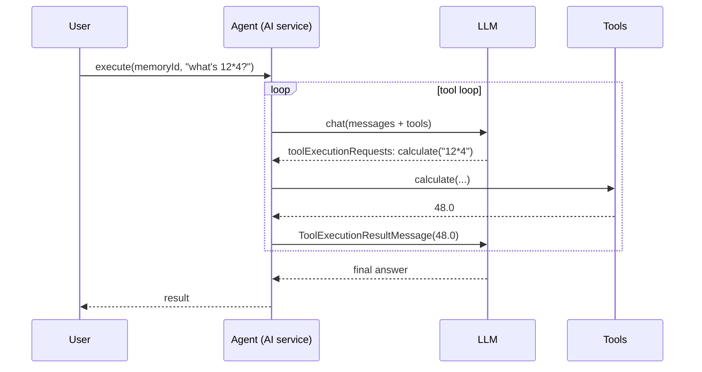

# 21 — Tool-using agent (reason → call → observe)

## Overview
`Agent` is an AI service wired with `@Tool`s. A single user call can become a loop
of *reason → call tool → observe result* that LangChain4j drives under the hood.
The agent has access to `DocumentSearchTool`, `CalculatorTool`, and
`EmbeddingStoreStatsTool`.

## Key concepts / API
- `AiServices.builder(Agent.class).tools(calc, search, stats).build()` — register
  the tool set.
- The `@SystemMessage` tells the model *when* to use each tool.
- Under the hood: request → `AiMessage` with `toolExecutionRequests` →
  execute tool → `ToolExecutionResultMessage` → next request → final answer.
- Tools may be executed concurrently (`.executeToolsConcurrently()`) for parallel
  tool calls.

## Code snippet
```java
public interface Agent {
    @SystemMessage("""
            You are an agent that accomplishes the user's task using the available tools.
            Use the "searchDocuments" tool when the task asks about the indexed documents or your own data.
            Use the "calculate" tool for arithmetic computations.
            Use the "getEmbeddingStoreStats" tool when asked about the embedding store.
            If the task does not need a tool, answer directly. Be concise.
            """)
    String execute(@MemoryId String memoryId, @UserMessage String task);
}
```

## Diagram


## Lessons learned / gotchas
- Tool descriptions in `@SystemMessage` are instructions, not the tool schema —
  they steer *when* tools are used.
- The loop can run several times for complex tasks (delegation to tools that need
  multiple steps).
- `Result<T>` return type exposes `toolExecutions()` (requests + results) and
  `tokenUsage()`.
- Keep the instruction list short; models follow it better.

## Related files
- `ai/Agent.java`, `agent/CalculatorTool.java`, `agent/DocumentSearchTool.java`,
  `agent/EmbeddingStoreStatsTool.java`, `config/AiConfig.java`,
  `chain/ChainService.java`, `ChatCli.java` (`/agent`).

## References
- https://docs.langchain4j.dev/tutorials/tools — High-level tool API + execution loop
- https://docs.langchain4j.dev/tutorials/ai-services — Tools section
