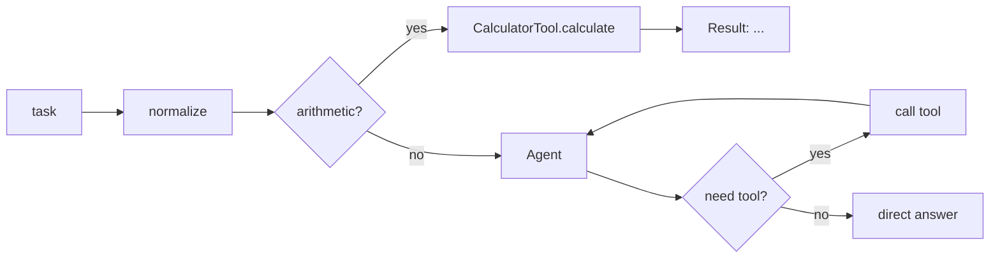

# 22 — Processing chain (deterministic + LLM)

## Overview
`ChainService` composes a **deterministic** preprocess stage with the LLM-powered
agent. Purely numeric arithmetic is resolved locally by `CalculatorTool` and never
reaches the chat model; everything else is delegated to the agent. This is the
"deterministic app controls the flow, LLM is one component" pattern.

## Key concepts / API
- Stage 1 (preprocess): normalize + classify; short-circuit arithmetic via
  `CalculatorTool.isArithmetic(expression)`.
- Stage 2 (execute): delegate everything else to `Agent.execute(memoryId, task)`.
- The agent then decides between answering directly or calling a tool.

## Code snippet
```java
@Service
public class ChainService {
    public String ask(String memoryId, String task) {
        String normalized = task.trim();
        if (CalculatorTool.isArithmetic(normalized)) {
            return "Result: " + calculatorTool.calculate(normalized);
        }
        return agent.execute(memoryId, normalized);
    }
}
```

## Diagram


## Lessons learned / gotchas
- Short-circuiting saves tokens, latency, and avoids model arithmetic errors for
  exact computation.
- Deterministic routing + LLM autonomy is a spectrum; this sits at the
  deterministic end. AI Services can also be chained for more control (e.g. an
  `isGreeting` classifier decides which branch to take).
- Every branch is still testable: the calculator path is pure offline logic.

## Related files
- `chain/ChainService.java`, `agent/CalculatorTool.java`, `ai/Agent.java`,
  `api/ChatApiController.java` (`/agent`), `src/test/java/dev/prasadgaikwad/langchain4jdemo/chain/*`.

## References
- https://docs.langchain4j.dev/tutorials/ai-services — "Chaining multiple AI services" section
