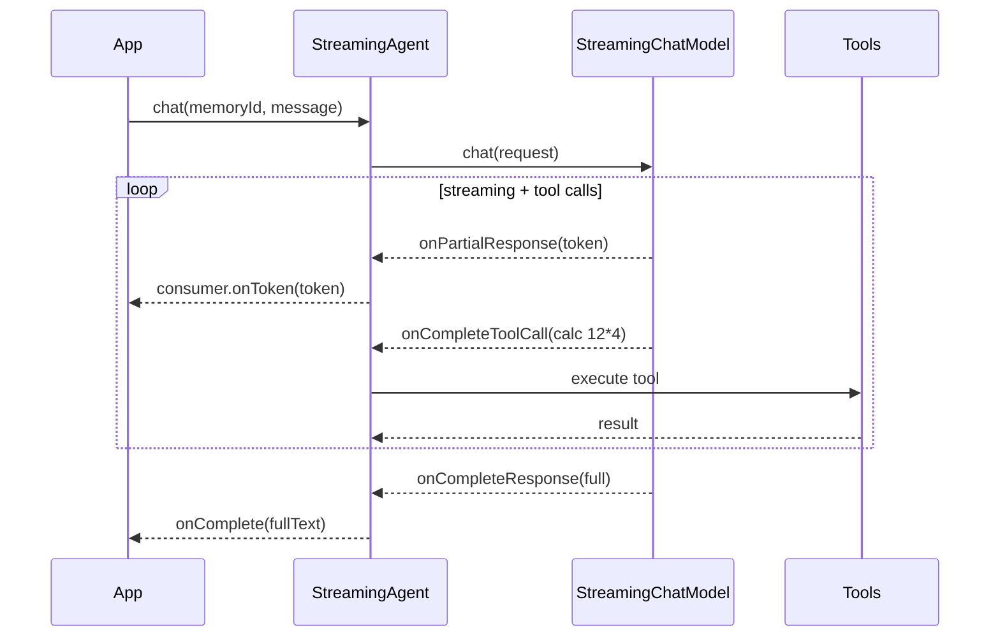

# 23 — Streaming AI service (`TokenStream`)

## Overview
`StreamingAgent` streams the model's reply token-by-token while still being able
to call `@Tool` methods — streaming function calling. The return type `TokenStream`
gives callback-based consumption (`.onPartialResponse(...).start()`).

## Key concepts / API
- AI service method returns `TokenStream` (not `String`).
- Callbacks: `onPartialResponse`, `onCompleteResponse`, `onError`, and for tools:
  `onPartialToolCall`, `onCompleteToolCall`, `onToolExecuted` (→ 21).
- Must end with `.start()` to begin streaming.
- Requires a `StreamingChatModel` (→ 26) wired via `.streamingChatModel(...)`.

## Code snippet
```java
public interface StreamingAgent {
    TokenStream chat(@MemoryId String memoryId, @UserMessage String message);
}

// usage
TokenStream stream = streamingAgent.chat(memoryId, task);
stream.onPartialResponse(System.out::print)
      .onCompleteResponse(response -> System.out.println())
      .onError(error -> System.out.println("Stream error: " + error.getMessage()))
      .start();
```

## Diagram


## Lessons learned / gotchas
- Streaming **function calling** is a real capability: tool calls are streamed
  (`onPartialToolCall` per token), executed, then the final answer streams back.
- Never forget `.start()` — nothing happens otherwise.
- All callback chains are fluent; register every callback you need in one chain.
- For raw provider streaming events use `onUnmappedRawEvent` (official docs).

## Related files
- `streaming/StreamingAgent.java`, `config/AiConfig.java`
  (`streamingChatModel`, `streamingAgent` beans), `ChatCli.java` (`/stream`),
  `src/test/java/dev/prasadgaikwad/langchain4jdemo/streaming/*`.

## References
- https://docs.langchain4j.dev/tutorials/response-streaming — Response streaming tutorial
- https://docs.langchain4j.dev/tutorials/ai-services — Streaming section
