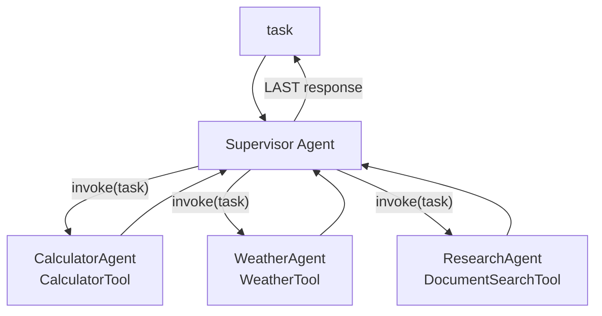

# 24 — Typed sub-agents & supervisor delegation

## Overview
`CrewService` builds a small multi-agent system from the experimental
`langchain4j-agentic` module: a **supervisor** receives the task and delegates to
specialized worker agents (calculator, weather, research), each a **typed** AI
service bound to one existing tool. Every agent shares the single `ModelRegistry`
`ChatModel` bean.

## Key concepts / API
- `AgenticServices.supervisorBuilder()` — `.name()`, `.description()`,
  `.supervisorContext(...)`, `.chatModel(...)`, `.chatMemoryProvider(...)`,
  `.subAgents(...)`, `.responseStrategy(...)`, `.maxAgentsInvocations(...)`.
- `AgenticServices.agentBuilder(CrewTaskAgent.class)` — build a worker sub-agent
  with `.name()`, `.description()`, `.chatModel()`, `.tools()`.
- Worker interface: `@SystemMessage` + `@UserMessage` with a `{{task}}` template
  and `@Agent` annotation; the supervisor passes the user request as the `task`
  argument **by name** (`@V("task")`).
- `SupervisorResponseStrategy.LAST` — return the last sub-agent's response.

## Code snippet
```java
public interface CrewTaskAgent {
    @SystemMessage("You are a specialist agent. Complete the task delegated to you using the tools "
            + "available. Return the final answer and nothing else.")
    @UserMessage("You have been delegated the following task. Use the tools available to complete it.\n"
            + "Delegated task: {{task}}")
    @Agent
    String run(@V("task") String task);
}

// build
CrewTaskAgent calculatorAgent = buildAgent("Calculator",
        "Useful for arithmetic and any kind of math. Delegate calculations here.",
        chatModel, calculatorTool);

this.supervisor = AgenticServices.supervisorBuilder()
        .name("Crew")
        .description("Coordinates the demo crew of specialized agents.")
        .supervisorContext("When delegating, always pass the entire user request as the "
                + "\"task\" argument of the agent invocation. Do not answer the user yourself; "
                + "always delegate to one of the sub-agents. Once resolved, return an agentName "
                + "of \"done\" with a recap as the \"response\" argument.")
        .chatModel(chatModel)
        .chatMemoryProvider(memoryProvider)
        .subAgents(calculatorAgent, weatherAgent, researchAgent)
        .responseStrategy(SupervisorResponseStrategy.LAST)
        .maxAgentsInvocations(10)
        .build();
```

## Diagram


## Lessons learned / gotchas
- **Typed** sub-agents are the correct pattern — the delegation contract is an
  interface method, and the task map is delivered by name. See
  → 25-troubleshooting-delegation.md for what happens with untyped sub-agents.
- The `supervisorContext` prompt is critical: it tells the supervisor to pass the
  whole request as `task` and to signal completion via `agentName="done"`.
- `maxAgentsInvocations(10)` bounds runaway delegation.
- Agentic module uses its own `-betaNN` versioning (not the BOM) — see `pom.xml`.

## Related files
- `agentic/CrewService.java`, `agentic/CrewTaskAgent.java`,
  `agent/CalculatorTool.java`, `agent/WeatherTool.java`,
  `agent/DocumentSearchTool.java`, `pom.xml` (`langchain4j-agentic`),
  `ChatCli.java` (`/crew`), `src/test/java/dev/prasadgaikwad/langchain4jdemo/agentic/*`.

## References
- https://docs.langchain4j.dev/tutorials/agents-and-agentic-ai — Agents and agentic AI tutorial
