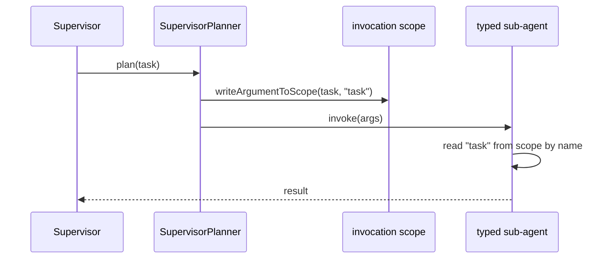

# 25 — Troubleshooting: why untyped `invoke(Map)` sub-agents never got the task

## Overview
This is the bug that cost us the most debugging time. In an earlier revision,
`CrewService` delegated to sub-agents with an **untyped** contract — a plain
`UntypedAgent.invoke(@V("input") Map)` interface plus a `.userMessageProvider(...)` —
and the sub-agents **never received the delegated task map**. They received the
string `"default"` (the memory id) instead.

## Root cause
`AiServices`' `userMessageProvider` is invoked with the **chat memory id**, not
with the method arguments. `UntypedAgent.invoke(@V("input") Map)` only declares a
`@V`-annotated parameter, so LangChain4j binds the provider's input — which is the
memory id `"default"` — as `"input"`. The task map was silently dropped.

Proof came from a probe test (`probeAiServicesDirect`) that invoked the AI service
with a fake `ChatModel` and asserted on the built `ChatRequest` user message: it
contained `"default"`, not the task.

## The correct pattern
Use **typed** sub-agents with a dedicated `@UserMessage` template:

```java
public interface CrewTaskAgent {
    @SystemMessage("You are a specialist agent. Complete the task delegated to you...")
    @UserMessage("Delegated task: {{task}}")
    @Agent
    String run(@V("task") String task);
}
```

How it works: the supervisor planner writes the delegation into the agent's
`AgentInvocation.arguments`, and the framework maps them into the invocation scope
**by declared argument name** (`writeArgumentToScope`); the method invoker builds
positional args from the scope state, so `task` receives the delegated text.

## Diagram


## Lessons learned / gotchas
- **Never** rely on `userMessageProvider` to receive method arguments — it
  receives the memory id.
- **Always** declare the delegation contract as a typed method with `@V`-named
  params (or parameter names via `-parameters`).
- When delegation misbehaves, probe the actual `ChatRequest` with a fake model and
  assert on the user message text — it turns an invisible framework behavior into
  a failing test.
- Regression test: `subAgentReceivesTheDelegatedTask` (in `agentic` tests) keeps
  the fix locked in.

## Related files
- `agentic/CrewTaskAgent.java` (fixed contract), `agentic/CrewService.java`,
  `src/test/java/dev/prasadgaikwad/langchain4jdemo/agentic/*`
  (regression + probe tests).

## References
- https://docs.langchain4j.dev/tutorials/agents-and-agentic-ai — agent delegation & scope
