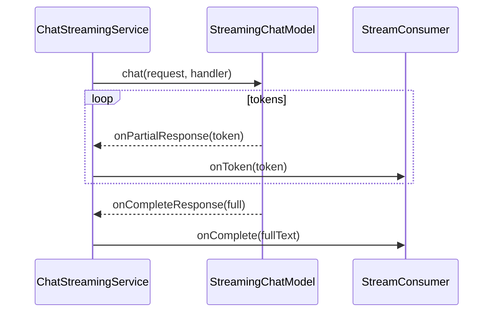

# 26 — Streaming model (`StreamingChatModel` + handler)

## Overview
`ChatStreamingService` streams a single chat request through a
`StreamingChatModel`, forwarding each token to a `StreamConsumer` callback
interface. It is dependency-free of the web layer so it can be unit-tested with a
fake streaming model; both the SSE endpoint and the WebSocket handler use it
(→ 27).

## Key concepts / API
- `StreamingChatModel.chat(ChatRequest, StreamingChatResponseHandler)` — async.
- Handler callbacks: `onPartialResponse(String)`, `onCompleteResponse(ChatResponse)`,
  `onError(Throwable)`; plus tool-call callbacks for streaming function calling.
- `StreamConsumer` — the demo's own callback contract: `onToken`, `onComplete`,
  `onError`.
- Contrast with `TokenStream` (→ 23): this is the **low-level** streaming API.

## Code snippet
```java
public void stream(String message, StreamConsumer consumer) {
    streamingChatModel.chat(ChatRequest.builder()
            .messages(List.of(
                    SystemMessage.from("You are a helpful assistant. Answer concisely."),
                    UserMessage.from(message)))
            .build(), new StreamingChatResponseHandler() {

        @Override
        public void onPartialResponse(String partialResponse) {
            consumer.onToken(partialResponse);
        }

        @Override
        public void onCompleteResponse(ChatResponse completeResponse) {
            consumer.onComplete(completeResponse.aiMessage().text());
        }

        @Override
        public void onError(Throwable error) {
            consumer.onError(error);
        }
    });
}
```

## Diagram


## Lessons learned / gotchas
- Keeping the service web-agnostic means it is trivially unit-testable with
  `FakeStreamingChatModel` (→ 34).
- `onCompleteResponse` supplies the final full text — used to persist history and
  end the SSE/WebSocket stream.
- The same service backs both transport styles (SSE and WebSocket), proving the
  value of a transport-agnostic streaming layer.

## Related files
- `streaming/ChatStreamingService.java`, `api/ChatApiController.java`
  (`/api/chat/stream`), `ws/ChatWebSocketHandler.java`,
  `src/test/java/dev/prasadgaikwad/langchain4jdemo/FakeStreamingChatModel.java`.

## References
- https://docs.langchain4j.dev/tutorials/response-streaming — Response streaming tutorial
