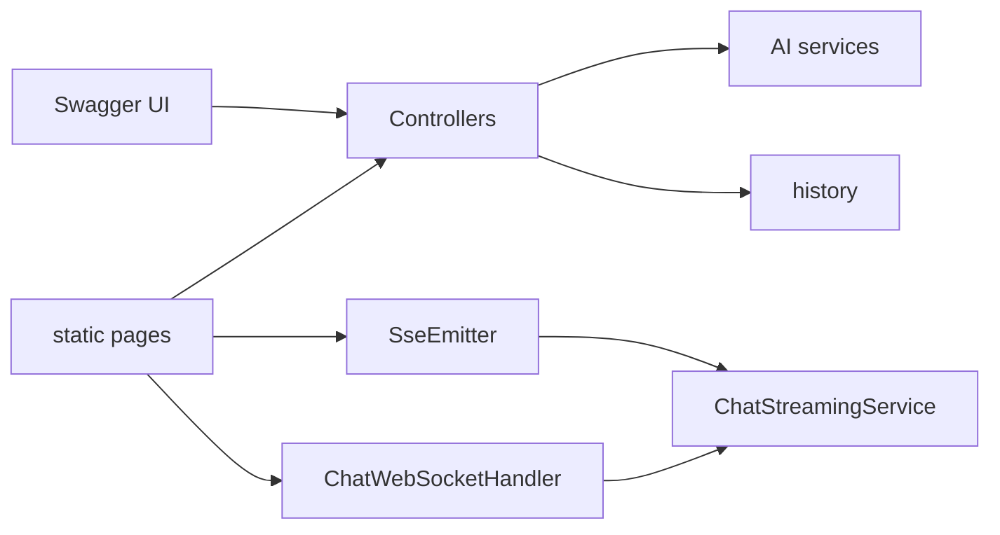

# 27 — Web layer: REST, SSE, WebSocket

## Overview
The demo exposes every capability over HTTP: classic REST JSON endpoints, a
Server-Sent-Events stream for token-by-token chat, and a WebSocket endpoint. All
are OpenAPI-documented (springdoc/Swagger UI), and static pages (`index.html`,
`chat.html`) call them.

## Key concepts / API
- **REST** (`api/`): `/api/chat`, `/api/ask`, `/api/agent`, `/api/chat/stream`,
  `/api/index`, `/api/search`, `/api/store`, `/api/sentiment`, `/api/movie`,
  `/api/topics`, `/api/template`, `/api/describe`, `/api/history[/{id}]`.
- **SSE**: `SseEmitter` returns `text/event-stream`; one JSON-encoded token per
  event (whitespace-safe, see gotcha).
- **WebSocket**: `ChatWebSocketHandler extends TextWebSocketHandler` — JSON
  payload in, one text frame per token, `[DONE]` frame, `[ERROR]` on failure.
- Both transports consume the same `ChatStreamingService.StreamConsumer` (→ 26).
- Config: Swagger at `/swagger-ui.html`, H2 console at `/h2-console`, Actuator
  health/metrics exposed.

## Code snippet
```java
// SSE endpoint — token per event
@GetMapping(value = "/chat/stream", produces = MediaType.TEXT_EVENT_STREAM_VALUE)
public SseEmitter stream(@RequestParam String message,
                         @RequestParam(defaultValue = "api") String conversationId) {
    SseEmitter emitter = new SseEmitter(60_000L);
    streamingService.stream(message, new ChatStreamingService.StreamConsumer() {
        @Override public void onToken(String token) {
            send(emitter, token); // JSON-encoded
        }
        @Override public void onComplete(String fullText) {
            recordTurn(conversationId, message, fullText);
            emitter.complete();
        }
        @Override public void onError(Throwable error) {
            emitter.completeWithError(error);
        }
    });
    return emitter;
}
```

## Diagram


## Lessons learned / gotchas
- **SSE whitespace bug:** a plain `data: ` line drops a leading space, silently
  merging words. JSON-encode each token (`objectMapper.writeValueAsString(token)`)
  to preserve whitespace.
- `conversationId` is the memory id — a new id starts a fresh conversation; each
  turn is persisted to history (→ 12).
- WebSocket sends a sentinel `[DONE]` frame so the client knows the stream ended.
- `SseEmitter` needs a timeout (60s here) to avoid dangling connections.

## Related files
- `api/*Controller.java` + records, `ws/ChatWebSocketHandler.java`,
  `streaming/ChatStreamingService.java`, `application.properties`
  (`springdoc.*`, `management.*`, `spring.h2.console.enabled`),
  `src/main/resources/static/index.html`, `chat.html`.

## References
- https://docs.langchain4j.dev/integrations/frameworks/spring-boot — Spring Boot integration
