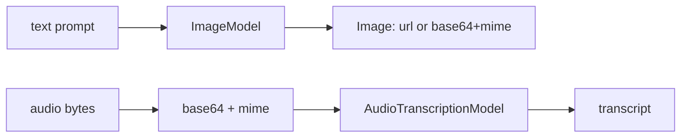

# 29 — Multimodal: image generation & speech-to-text

## Overview
`ImageGenerationService` turns a text prompt into an image via `ImageModel`
(OpenAI `gpt-image-1`); `SpeechToTextService` transcribes audio bytes via
`AudioTranscriptionModel` (OpenAI `whisper-1`). Both wrap the model in a thin
offline-testable service.

## Key concepts / API
- `ImageModel.generate(prompt)` → `Response<Image>`; `generate(prompt, n)` →
  multiple.
- `Image` carries `url()` **or** `base64Data()` + `mimeType()`.
- `AudioTranscriptionModel.transcribeToText(Audio)`; `Audio.builder()`
  `.base64Data(...)` `.mimeType(...)`.
- Beans: `imageModel`, `audioTranscriptionModel` in `AiConfig` (model names from
  `app.image.model-name`, `app.stt.model-name`).

## Code snippet
```java
// image generation
public Image generate(String prompt) {
    return imageModel.generate(prompt).content();
}

// speech-to-text
public String transcribe(byte[] audioData, String mimeType) {
    Audio audio = Audio.builder()
            .base64Data(Base64.getEncoder().encodeToString(audioData))
            .mimeType(mimeType)
            .build();
    return transcriptionModel.transcribeToText(audio);
}
```

## Diagram


## Lessons learned / gotchas
- Always handle both `Image.url()` and `Image.base64Data()` — the model decides
  which is returned (the CLI prints accordingly).
- Audio mime detection is extension-based in `ChatCli` (`audio/mpeg`,
  `audio/ogg`, `audio/mp4`, default `audio/wav`).
- Both services are trivially unit-testable with fakes (`FakeImageModel`,
  `FakeAudioTranscriptionModel`), keeping the suite offline.

## Related files
- `multimodal/ImageGenerationService.java`, `multimodal/SpeechToTextService.java`,
  `config/AiConfig.java`, `ChatCli.java` (`/generate`, `/transcribe`),
  `application.properties` (`app.image.*`, `app.stt.*`),
  `src/test/java/dev/prasadgaikwad/langchain4jdemo/FakeImageModel.java`,
  `FakeAudioTranscriptionModel.java`.

## References
- https://docs.langchain4j.dev/tutorials/image-models — Image models tutorial
- https://docs.langchain4j.dev/integrations/image-models — Supported image models
- https://docs.langchain4j.dev/integrations/audio-models — Supported audio models
