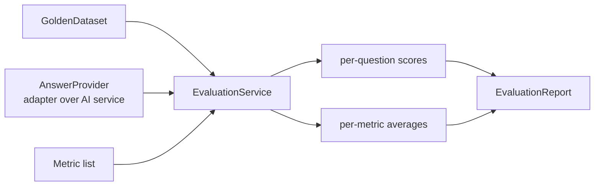

# 30 — Evaluation: golden datasets & pipeline

## Overview
`EvaluationService` runs a **golden dataset** (question → expected answer) through
an `AnswerProvider` (an adapter over any AI service) and scores every answer with
the configured metrics, producing an `EvaluationReport` with per-question scores
and per-metric averages.

## Key concepts / API
- `GoldenDataset(name, List<GoldenQuestion>)` — factory methods `rag()`,
  `chat()`, `sentiment()`.
- `GoldenQuestion(question, expectedAnswer)`.
- `AnswerProvider.answer(question)` — a functional adapter; e.g. `QaService::ask`,
  `assistant::chat`, or the sentiment classifier.
- `EvaluationService.evaluate(dataset, provider)` uses `defaultMetrics()`
  (→ 31, 32); results in `EvaluationReport` (`items`, `averageScores`).
- CLI: `/eval [rag|chat|sentiment]`, `/eval compare ...` (→ 33).

## Code snippet
```java
GoldenDataset dataset = GoldenDataset.rag();
AnswerProvider provider = question -> qaService.ask(memoryId, question);
EvaluationReport report = evaluationService.evaluate(dataset, provider);
// report.items() -> per-question scores
// report.averageScores() -> per-metric averages
```

## Diagram


## Lessons learned / gotchas
- The `AnswerProvider` interface is what makes **any** AI service evaluable —
  swap the adapter, keep the metrics.
- Datasets are small (3 questions) so `/eval` runs fast and offline in tests.
- Expected answers are written against `sample-data/` documents for RAG.
- Rounding to 2 decimals keeps reports readable.

## Related files
- `evaluation/EvaluationService.java`, `evaluation/GoldenDataset.java`,
  `evaluation/AnswerProvider.java`, `evaluation/EvaluationReport.java`,
  `evaluation/EvaluationReportItem.java`, `ChatCli.java` (`/eval`),
  `sample-data/`.

## References
- https://docs.langchain4j.dev/tutorials/testing-and-evaluation — Testing and evaluation tutorial
