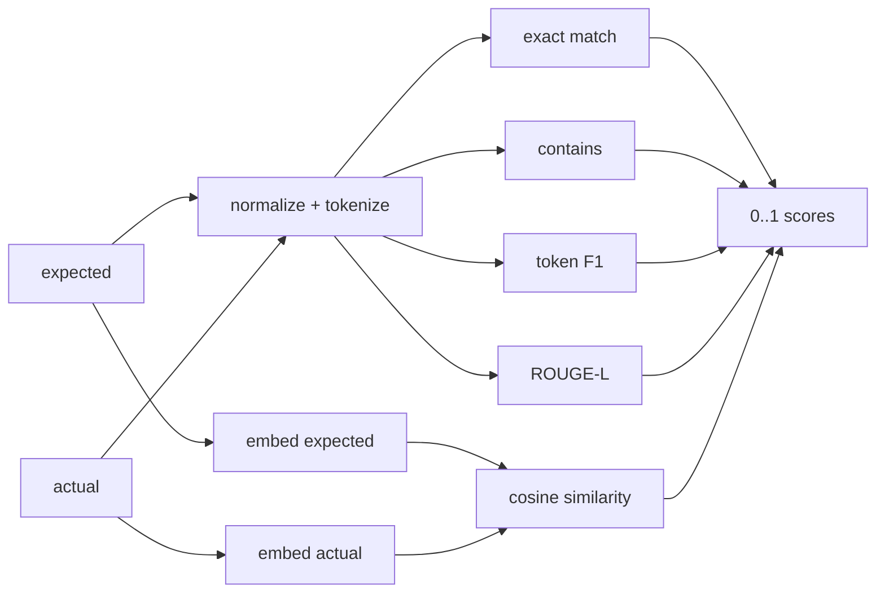

# 31 — Evaluation: deterministic & embedding metrics

## Overview
`Metrics` is a factory of `Metric`s. The deterministic metrics (exact match,
containment, F1, ROUGE-L) run fully offline; the embedding-similarity metric
scores semantic closeness using the app's own embedding model. All return scores
in `[0, 1]`.

## Key concepts / API
- `Metric.name()` + `Metric.evaluate(question, expected, actual)`.
- `exactMatch()` — normalized string equality.
- `contains()` — expected is a substring of actual.
- `f1()` — token-level harmonic mean of precision/recall (punishes missing facts
  and hallucinated extras).
- `rougeL()` — order-aware F-measure over the longest common subsequence.
- `embeddingSimilarity(embedder)` — cosine similarity between the embeddings of
  expected and actual answers.

## Code snippet
```java
public static Metric f1() {
    return new Metric() {
        @Override public String name() { return "f1"; }
        @Override public double evaluate(String question, String expected, String actual) {
            List<String> expectedTokens = tokenize(expected);
            List<String> actualTokens = tokenize(actual);
            if (expectedTokens.isEmpty() && actualTokens.isEmpty()) return 1.0;
            if (expectedTokens.isEmpty() || actualTokens.isEmpty()) return 0.0;
            int overlap = overlapCount(expectedTokens, actualTokens);
            double precision = overlap / (double) actualTokens.size();
            double recall = overlap / (double) expectedTokens.size();
            if (precision + recall == 0.0) return 0.0;
            return 2 * precision * recall / (precision + recall);
        }
    };
}
```

## Diagram


## Lessons learned / gotchas
- Empty-vs-empty returns `1.0` for F1/ROUGE-L — deliberate edge-case handling.
- Normalization (`toLowerCase`, keep alphanumerics) makes string metrics robust to
  case/punctuation.
- F1 punishes hallucinations (low precision) as well as omissions (low recall);
  ROUGE-L additionally respects word order.
- Embedding similarity is only as good as the embedding model — a fake model in
  tests still exercises the pipeline offline.

## Related files
- `evaluation/Metrics.java`, `evaluation/Metric.java`,
  `evaluation/EvaluationService.java`, `src/test/java/dev/prasadgaikwad/langchain4jdemo/evaluation/*`.

## References
- https://docs.langchain4j.dev/tutorials/testing-and-evaluation — Testing and evaluation tutorial
