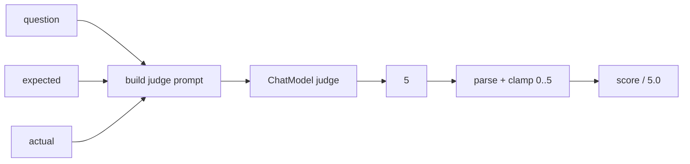

# 32 — Evaluation: LLM-as-a-judge

## Overview
`Metrics.judgeScore(judge)` asks a `ChatModel` to rate how faithful the produced
answer is to the expected answer on a 0–5 scale, then normalizes to `[0, 1]`.
The judge is the same chat model the app uses (a fake in tests), so it runs
offline.

## Key concepts / API
- Judge request: `SystemMessage` (strict evaluator prompt) + a `UserMessage` with
  question, expected answer, produced answer.
- Reply must be a **single integer** 0–5; parsed with a regex (`\d+`), clamped.
- Score = `parsed / 5.0`.

## Code snippet
```java
public static Metric judgeScore(ChatModel judge) {
    return new Metric() {
        @Override public String name() { return "judge"; }
        @Override public double evaluate(String question, String expected, String actual) {
            ChatResponse response = judge.chat(ChatRequest.builder()
                    .messages(List.of(
                            SystemMessage.from(JUDGE_SYSTEM_PROMPT),
                            UserMessage.from("Question: " + question + "\n"
                                    + "Expected answer: " + expected + "\n"
                                    + "Produced answer: " + actual)))
                    .build());
            return parseJudgeScore(response.aiMessage().text()) / 5.0;
        }
    };
}

private static int parseJudgeScore(String text) {
    Matcher matcher = NUMBER_PATTERN.matcher(text);
    if (!matcher.find()) return 0;
    int score = Integer.parseInt(matcher.group());
    return Math.max(0, Math.min(5, score));
}
```

## Diagram


## Lessons learned / gotchas
- The judge prompt must insist on a **single integer** reply; the regex + clamp
  tolerates models that add prose.
- A missing number parses to `0` — fail-safe but worth knowing.
- LLM-as-a-judge is the most flexible metric but the least deterministic; combine
  it with the offline metrics (→ 31) for a balanced report.
- Since the app's judge is the current `ModelRegistry` selection, switching
  provider/model changes the judge too (→ 04).

## Related files
- `evaluation/Metrics.java`, `evaluation/EvaluationService.java`
  (`defaultMetrics()` includes `judgeScore`), `src/test/java/dev/prasadgaikwad/langchain4jdemo/evaluation/*`.

## References
- https://docs.langchain4j.dev/tutorials/testing-and-evaluation — Testing and evaluation tutorial
