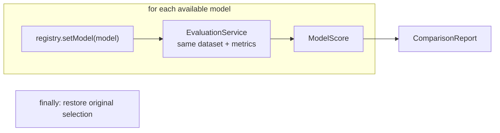

# 33 — Model comparison across providers

## Overview
`ModelComparisonService` runs a golden dataset against **every available model**
(`ModelRegistry.availableModels()`) and collects the averaged scores into a
`ComparisonReport`. The user's current selection is restored afterwards.

## Key concepts / API
- `ModelRegistry.setModel(model)` switches the shared chat model; since the
  registry is the single `ChatModel` bean, switching it also switches the
  LLM-as-a-judge metric for each model.
- `availableModels()` = providers with an API key present + Ollama (→ 04).
- `ComparisonReport(name, List<ModelScore>)`; `ModelScore(model, scores)`.
- `finally { registry.setModel(originalProvider, originalModelName); }` restores
  the selection even on failure.

## Code snippet
```java
public ComparisonReport compare(GoldenDataset dataset, AnswerProvider provider) {
    LlmProvider originalProvider = modelRegistry.currentProvider();
    String originalModelName = modelRegistry.currentModelName();
    try {
        List<ModelScore> rows = new ArrayList<>();
        for (String model : modelRegistry.availableModels()) {
            modelRegistry.setModel(model);
            EvaluationReport report = evaluationService.evaluate(dataset, provider);
            rows.add(new ModelScore(model, report.averageScores()));
        }
        return new ComparisonReport(dataset.name(), rows);
    } finally {
        modelRegistry.setModel(originalProvider, originalModelName);
    }
}
```

## Diagram


## Lessons learned / gotchas
- The **restore-in-`finally`** pattern is critical: a failing evaluation must not
  leave the app on a different model.
- Because the judge is the model under test, a single dataset yields a
  head-to-head that includes self-judging bias — good for a rough ranking.
- CLI: `/eval compare rag` prints a table of averaged scores per model.

## Related files
- `llm/ModelComparisonService.java`, `llm/ComparisonReport.java`,
  `llm/ModelScore.java`, `llm/ModelRegistry.java`, `ChatCli.java`
  (`/eval compare`), `src/test/java/dev/prasadgaikwad/langchain4jdemo/llm/*`.

## References
- https://docs.langchain4j.dev/integrations/language-models — Supported chat models
- https://docs.langchain4j.dev/tutorials/testing-and-evaluation
