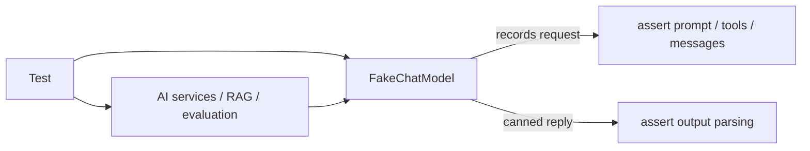

# 34 — Fake models for offline testing

## Overview
The test suite runs **fully offline** using fake implementations of the model
interfaces (`FakeChatModel`, `FakeEmbeddingModel`, `FakeStreamingChatModel`,
`FakeImageModel`, `FakeAudioTranscriptionModel`, plus `ScriptedSupervisorChatModel`
for the agentic crew). They capture the generated requests so tests can assert on
the exact prompts, tools, and messages.

## Key concepts / API
- Implement the LangChain4j model interface directly (e.g. `ChatModel.doChat`).
- Record the last `ChatRequest` for assertions: `lastMessages()`,
  `lastSystemMessage()`, `lastUserMessage()`, `lastRequestToolNames()`.
- Return canned responses so parsing (enum, record, JSON schema) is testable.
- Package-private constructors (e.g. in `SemanticSearchService`, `ModelRegistry`)
  let tests inject fakes without Spring/API keys.
- `ScriptedSupervisorChatModel` scripts a multi-turn tool/supervisor exchange to
  drive the agentic delegation tests deterministically.

## Code snippet
```java
public class FakeChatModel implements ChatModel {
    private final String responseText;
    private ChatRequest lastRequest;

    @Override
    public ChatResponse doChat(ChatRequest chatRequest) {
        this.lastRequest = chatRequest;
        return ChatResponse.builder()
                .aiMessage(AiMessage.from(responseText))
                .build();
    }

    public String lastUserMessage() { /* assert on built prompt */ }
    public List<String> lastRequestToolNames() { /* assert on tool set */ }
}
```

## Diagram


## Lessons learned / gotchas
- Offline tests mean CI never needs API keys and never costs tokens.
- Asserting on the **generated request** turns invisible framework behavior
  (e.g. the delegation bug → 25) into failing tests.
- Tests configure `app.cli.enabled=false` so the context loads without blocking
  on stdin.
- The `ModelRegistry` test constructor fixes `availableModels()` to the fakes, so
  model-comparison tests are independent of environment keys (→ 04).

## Related files
- `src/test/java/dev/prasadgaikwad/langchain4jdemo/FakeChatModel.java`,
  `FakeEmbeddingModel.java`, `FakeStreamingChatModel.java`,
  `FakeImageModel.java`, `FakeAudioTranscriptionModel.java`,
  `agentic/ScriptedSupervisorChatModel.java`, plus the per-package test classes.

## References
- https://docs.langchain4j.dev/tutorials/testing-and-evaluation — Testing and evaluation tutorial
