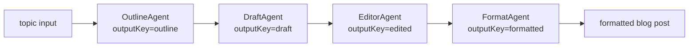

# 35 — Chain-of-Agents (Sequential Prompt Chaining)

## Overview
A deterministic "chain of agents" pipeline that runs four typed sub-agents
one after another, each consuming the previous step's output via a shared
`AgenticScope`. Built with LangChain4j's `AgenticServices.sequenceBuilder()`.
The demo blog-post pipeline is: Outline → Draft → Edit → Format.

## Key concepts / API
- **`AgenticServices.sequenceBuilder()`** — creates an `UntypedAgent` from an
  ordered list of sub-agents. Each sub-agent writes its result to a named key
  in the shared scope; the next agent reads the previous output by the same key.
- **Typed sub-agent interfaces** — each stage is a plain Java interface annotated
  with `@SystemMessage`, `@UserMessage`, and `@Agent(outputKey=...)`. Built
  individually with `AgenticServices.agentBuilder()` and wired into the sequence.
- **`UntypedAgent.invokeWithAgenticScope()`** — returns a
  `ResultWithAgenticScope<String>` whose `.agenticScope()` exposes every
  intermediate output via `readState(key)`.
- **Shared `ChatModel`** — all four agents and the pipeline share the single
  `ModelRegistry` bean, so switching provider/model switches the whole chain.

## Code snippet
```java
// Each sub-agent is built from a typed interface
OutlineAgent outlineAgent = AgenticServices.agentBuilder(OutlineAgent.class)
        .chatModel(chatModel).build();
// ... DraftAgent, EditorAgent, FormatAgent ...

UntypedAgent pipeline = AgenticServices.sequenceBuilder()
        .subAgents(outlineAgent, draftAgent, editorAgent, formatAgent)
        .outputKey("formatted")
        .build();

// Run and get the full trace
ResultWithAgenticScope<String> result =
        pipeline.invokeWithAgenticScope(Map.of("topic", topic));
String formatted = result.result();
String outline = result.agenticScope().readState("outline", (String) null);
```

## Sub-agent interfaces
```java
@SystemMessage("You are a blog post outline specialist...")
@UserMessage("Create a blog post outline for the following topic...{{topic}}")
public interface OutlineAgent {
    @Agent(outputKey = "outline", description = "Creates a structured blog post outline")
    String createOutline(@V("topic") String topic);
}

// DraftAgent(outputKey="draft"), EditorAgent(outputKey="edited"),
// FormatAgent(outputKey="formatted") follow the same pattern.
```

## Diagram


## Lessons learned / gotchas
- **`@SystemMessage`/`@UserMessage` go on the method, not the interface.**
  Placing them at the interface level causes a compile error:
  `annotation interface not applicable to this kind of declaration`.
- **`UntypedAgent.invoke()` returns `Object`**, not `Map<String, Object>`.
  To access all intermediate outputs, use `invokeWithAgenticScope()` and
  `agenticScope().readState("key")`.
- **Each sub-agent is built independently** with `AgenticServices.agentBuilder()`
  and its own `chatModel(...)` call, then composed via `sequenceBuilder()`.
- **The `outputKey("formatted")` call on the sequence builder** tells the
  pipeline which scope key becomes the top-level return value of
  `invoke()`.
- **Scope keys must be unique** across all sub-agents in the sequence; each
  agent's `outputKey` writes to a different key in the shared scope.

## Related files
- `src/main/java/.../orchestration/OutlineAgent.java` — first stage
- `src/main/java/.../orchestration/DraftAgent.java` — second stage
- `src/main/java/.../orchestration/EditorAgent.java` — third stage
- `src/main/java/.../orchestration/FormatAgent.java` — fourth stage
- `src/main/java/.../orchestration/ChainOfAgentsService.java` — pipeline assembly
- `src/main/java/.../orchestration/ChainPipelineResult.java` — trace record
- `src/main/java/.../api/ChatApiController.java` — `POST /api/chain` endpoint
- `src/main/java/.../ChatCli.java` — `/chain <topic>` CLI command
- `src/test/java/.../orchestration/ChainOfAgentsServiceTest.java` — offline tests

## References
- https://docs.langchain4j.dev/tutorials/chain-of-agents/
- https://docs.langchain4j.dev/tutorials/agentic-services/
- https://docs.langchain4j.dev/tutorials/ai-services/#programmatic-configuration
