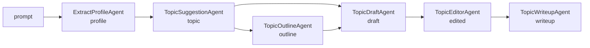

# 36 — Graph of Agents (GOAP / Goal-Oriented Action Planning)

## Overview
A goal-oriented agent graph pipeline where typed sub-agents declare their
required inputs and produced outputs, and a `GoalOrientedPlanner` computes the
shortest execution path across the agent dependency graph using A* search.
The demo pipeline is: Profile → Topic → Outline → Draft → Edit → Writeup.

## Key concepts / API
- **`AgenticServices.plannerBuilder()`** — creates an `UntypedAgent` from a set
  of sub-agents and a `Planner` supplier. The planner decides which agents to
  invoke and in what order.
- **`GoalOrientedPlanner`** (from `langchain4j-agentic-patterns`) — an
  algorithmic planner that builds a `GoalOrientedSearchGraph` from the
  sub-agents' preconditions and postconditions, then uses A* graph search to
  find the shortest path from the initial scope state to the goal.
- **Preconditions** = method parameter names (via `@V("key")` annotations).
- **Postconditions** = `outputKey` on each agent builder or `@Agent` annotation.
- **Goal** = the `outputKey` of the planner-based agent itself.
- **`langchain4j-agentic-patterns`** — a separate module containing GOAP, BDI,
  Blackboard, Debate, P2P, and Voting patterns.

## Code snippet
```java
// Each sub-agent declares its inputs (@V) and output (outputKey)
ExtractProfileAgent extractProfile = AgenticServices
        .agentBuilder(ExtractProfileAgent.class)
        .chatModel(chatModel).outputKey("profile").build();
// ... TopicSuggestionAgent, TopicOutlineAgent, etc.

// The planner agent uses GoalOrientedPlanner to compute the path
UntypedAgent pipeline = AgenticServices.plannerBuilder()
        .subAgents(extractProfile, topicSuggestion, outline, draft, editor, writeup)
        .outputKey("writeup")
        .planner(GoalOrientedPlanner::new)
        .build();

// Invoke — the planner computes the shortest path automatically
String result = (String) pipeline.invoke(Map.of("prompt", "I'm a DevOps engineer"));
```

## Dependency graph
| Agent | Reads (preconditions) | Writes (postcondition) |
|-------|----------------------|------------------------|
| ExtractProfileAgent | `prompt` | `profile` |
| TopicSuggestionAgent | `profile` | `topic` |
| TopicOutlineAgent | `topic` | `outline` |
| TopicDraftAgent | `topic`, `outline` | `draft` |
| TopicEditorAgent | `draft` | `edited` |
| TopicWriteupAgent | `profile`, `topic`, `outline`, `edited` | `writeup` |

The `GoalOrientedSearchGraph` builds a directed graph from these dependencies.
Given initial scope `{prompt}`, the A* search computes:
```
prompt → profile → topic → outline → draft → edited → writeup
```

## Diagram


## Lessons learned / gotchas
- **`langchain4j-agentic-patterns` is a separate module** from `langchain4j-agentic`.
  It has its own `-betaNN` version and must be added explicitly to `pom.xml`.
- **`plannerBuilder()` does not have a `chatModel()` method.** The `chatModel`
  is set on each individual agent builder, not on the planner builder. The
  planner is purely an orchestration layer — it doesn't invoke any LLM itself.
- **The planner is algorithmic, not LLM-driven.** It uses graph search
  (`DependencyGraphSearch` / A* heuristic) to find the shortest path, making
  it deterministic and fast. No LLM call is needed for planning.
- **Scope keys must be unique** across all sub-agents. The planner builds its
  graph from these keys, so collisions would produce incorrect paths.
- **The `agentPath` is not automatically stored in the `AgenticScope`.** To
  get the execution path, you need to read it from the `AgentMonitor` or
  infer it from the scope state changes.
- **Adding a new agent to the graph is declarative.** Just add a new interface
  with `@V` parameters and `outputKey`, build it with `agentBuilder()`, and
  add it to the `plannerBuilder().subAgents(...)` list. The planner
  automatically discovers its dependencies.

## Related files
- `src/main/java/.../orchestration/ExtractProfileAgent.java`
- `src/main/java/.../orchestration/TopicSuggestionAgent.java`
- `src/main/java/.../orchestration/TopicOutlineAgent.java`
- `src/main/java/.../orchestration/TopicDraftAgent.java`
- `src/main/java/.../orchestration/TopicEditorAgent.java`
- `src/main/java/.../orchestration/TopicWriteupAgent.java`
- `src/main/java/.../orchestration/GraphPipelineResult.java`
- `src/main/java/.../orchestration/GraphOfAgentsService.java`
- `src/main/java/.../api/GraphResponse.java`
- `src/main/java/.../api/ChatApiController.java` — `POST /api/graph`
- `src/main/java/.../ChatCli.java` — `/graph <prompt>`
- `src/test/java/.../orchestration/GraphOfAgentsServiceTest.java`

## References
- https://docs.langchain4j.dev/tutorials/agents/ (GOAP section)
- https://github.com/langchain4j/langchain4j/tree/main/langchain4j-agentic-patterns
- Goal-Oriented Action Planning (GOAP): https://en.wikipedia.org/wiki/Goal-oriented_action_planning
