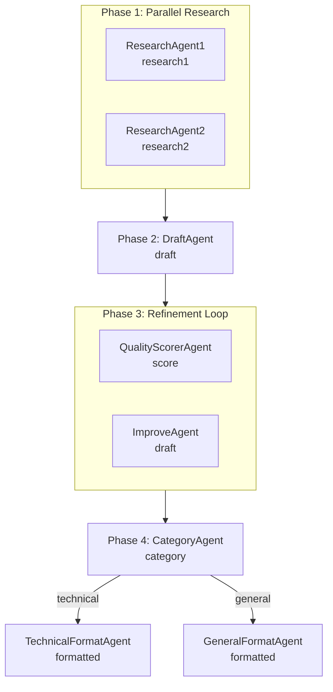

# Workflow Composition

Parallel, loop, and conditional workflow patterns built with `AgenticServices`.

## Overview

LangChain4j's `agentic` module provides three workflow building blocks that can be nested
inside each other:

- **Parallel** (`parallelBuilder`) — runs sub-agents concurrently, then merges results
- **Loop** (`loopBuilder`) — runs sub-agents repeatedly until an exit condition is met
- **Conditional** (`conditionalBuilder`) — routes to different sub-agents based on a predicate

These compose with `sequenceBuilder` to build complex pipelines from simple primitives.

## The Demo Pipeline

The workflow generates a blog post with three phases:



**Agents:**

| Agent | Reads | Writes | Pattern |
|-------|-------|--------|---------|
| `ResearchAgent1` | `topic` | `research1` | parallel |
| `ResearchAgent2` | `topic` | `research2` | parallel |
| `WorkflowDraftAgent` | `topic`, `research1`, `research2` | `draft` | sequential |
| `QualityScorerAgent` | `draft` | `score` | loop |
| `ImproveAgent` | `draft` | `draft` | loop |
| `CategoryAgent` | `topic` | `category` | sequential |
| `TechnicalFormatAgent` | `draft` | `formatted` | conditional |
| `GeneralFormatAgent` | `draft` | `formatted` | conditional |

## Key APIs

### Parallel

```java
ParallelAgentService<?> parallelResearch = AgenticServices.<String>parallelBuilder()
        .subAgents(researchAgent1, researchAgent2)
        .outputKey("research")
        .output(scope -> {
            String r1 = scope.readState("research1", "");
            String r2 = scope.readState("research2", "");
            return r1 + "\n\n" + r2;
        });
```

### Loop

```java
LoopAgentService<?> refinementLoop = AgenticServices.<String>loopBuilder()
        .subAgents(qualityScorer, improveAgent)
        .maxIterations(3)
        .exitCondition(scope -> scope.readState("score", 0.0) >= 0.8);
```

### Conditional

```java
AgenticServices.<String>conditionalBuilder()
        .subAgents(
                scope -> "technical".equals(scope.readState("category", "")),
                technicalFormat)
        .subAgents(
                scope -> !"technical".equals(scope.readState("category", "")),
                generalFormat)
```

### Composing in a Sequence

```java
this.pipeline = AgenticServices.sequenceBuilder()
        .subAgents(parallelResearch, draftAgent, refinementLoop, categoryAgent)
        .subAgents(conditionalFormatter)
        .outputKey("formatted")
        .build();
```

## Gotchas

1. **Parallel output() merges scope keys.** The `output()` function on `parallelBuilder`
   reads sub-agent outputs from the scope and combines them. Set `outputKey()` to write
   the merged result back.

2. **Loop exitCondition is checked after each iteration.** The predicate receives the
   current `AgenticScope`. The loop runs sub-agents sequentially within each iteration.

3. **Conditional predicates read scope state.** Each branch's predicate receives the
   current scope. Use `scope.readState("key", defaultValue)` to check conditions.

4. **Nested builders work.** A `parallelBuilder()`, `loopBuilder()`, or
   `conditionalBuilder()` can be passed as a sub-agent to `sequenceBuilder()`.
   The framework handles the delegation.

5. **No new dependency needed.** All three patterns live in `langchain4j-agentic`,
   which is already in the project.

## Related Files

- `src/main/java/dev/prasadgaikwad/langchain4jdemo/orchestration/ResearchAgent1.java`
- `src/main/java/dev/prasadgaikwad/langchain4jdemo/orchestration/ResearchAgent2.java`
- `src/main/java/dev/prasadgaikwad/langchain4jdemo/orchestration/WorkflowDraftAgent.java`
- `src/main/java/dev/prasadgaikwad/langchain4jdemo/orchestration/QualityScorerAgent.java`
- `src/main/java/dev/prasadgaikwad/langchain4jdemo/orchestration/ImproveAgent.java`
- `src/main/java/dev/prasadgaikwad/langchain4jdemo/orchestration/CategoryAgent.java`
- `src/main/java/dev/prasadgaikwad/langchain4jdemo/orchestration/TechnicalFormatAgent.java`
- `src/main/java/dev/prasadgaikwad/langchain4jdemo/orchestration/GeneralFormatAgent.java`
- `src/main/java/dev/prasadgaikwad/langchain4jdemo/orchestration/WorkflowOfAgentsService.java`
- `src/main/java/dev/prasadgaikwad/langchain4jdemo/orchestration/WorkflowPipelineResult.java`
- `src/test/java/dev/prasadgaikwad/langchain4jdemo/orchestration/WorkflowOfAgentsServiceTest.java`

## References

- [LangChain4j Agents Tutorial — Workflows](https://docs.langchain4j.dev/tutorials/agents)
