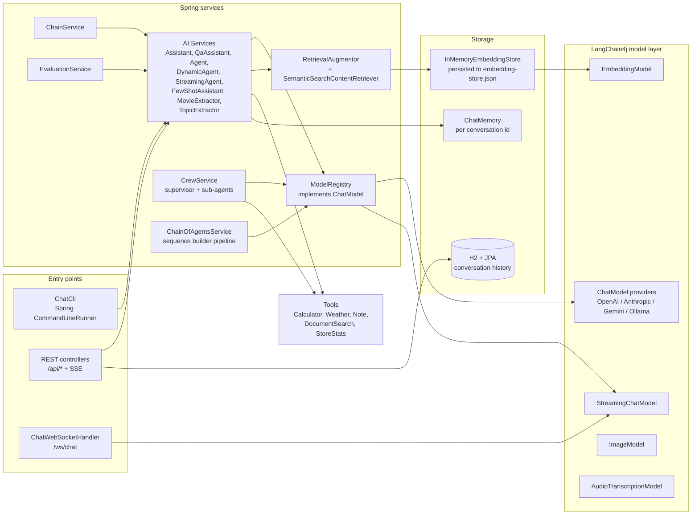

# Learnings

Concise, personal reference notes for everything this project taught us about
LangChain4j (1.19.0) and Spring Boot (4.1.0). These docs are **internal** —
they are our own cheat-sheets, not blog posts. Each one follows the same shape:

- **Overview** — what and why
- **Key concepts / API** — classes, annotations, config
- **Code snippet** — the essential demo code, trimmed
- **Diagram** — a mermaid flow
- **Lessons learned / gotchas** — pitfalls we actually hit, with the fix
- **Related files** — pointers into `src/main/java`, `src/main/resources`, tests
- **References** — links to the official LangChain4j docs

## Architecture at a glance

The single `ModelRegistry` bean is the app's only `ChatModel`; switching it at
runtime switches **every** AI service (assistant, RAG, agent, judge, crew).

## Index

### A. Fundamentals
| # | Doc | One-liner |
|---|-----|-----------|
| 01 | [app-architecture](01-app-architecture.md) | Module map, layers, config, how everything is wired |
| 02 | [ai-services](02-ai-services.md) | Declarative interfaces that `AiServices` turns into proxies |
| 03 | [chat-request-response](03-chat-request-response.md) | Low-level `ChatModel`/`ChatRequest`/`ChatResponse` pipeline |
| 04 | [model-registry](04-model-registry.md) | Runtime multi-provider model switching via a `ChatModel` facade |

### B. Prompt engineering
| # | Doc | One-liner |
|---|-----|-----------|
| 05 | [prompt-templates](05-prompt-templates.md) | `{{placeholder}}` templates rendered offline |
| 06 | [prompt-annotations](06-prompt-annotations.md) | `@SystemMessage` / `@UserMessage` on service interfaces |
| 07 | [few-shot](07-few-shot.md) | In-prompt labeled examples |
| 08 | [structured-enum](08-structured-enum.md) | Enum return type as output parser |
| 09 | [structured-record](09-structured-record.md) | Record return type parsed from JSON |
| 10 | [structured-json-schema](10-structured-json-schema.md) | JSON Schema response format at the model level |

### C. Memory
| # | Doc | One-liner |
|---|-----|-----------|
| 11 | [memory-types](11-memory-types.md) | Message-window vs token-window memory + id scheme |
| 12 | [memory-registry-history](12-memory-registry-history.md) | Inspecting memory + JPA-persisted history |

### D. RAG
| # | Doc | One-liner |
|---|-----|-----------|
| 13 | [document-loading](13-document-loading.md) | txt/md/pdf loading & parsing |
| 14 | [document-splitters](14-document-splitters.md) | Chunking strategies, size/overlap, filename prefix |
| 15 | [embeddings-vector-store](15-embeddings-vector-store.md) | Embed, store, persist, search |
| 16 | [rag-pipeline](16-rag-pipeline.md) | RetrievalAugmentor + custom ContentRetriever |

### E. Tools & agents
| # | Doc | One-liner |
|---|-----|-----------|
| 17 | [tool-basics](17-tool-basics.md) | `@Tool` + `@P` function calling |
| 18 | [tool-structured-params](18-tool-structured-params.md) | record + enum tool parameters |
| 19 | [tool-memory-state](19-tool-memory-state.md) | Per-conversation state with `@ToolMemoryId` |
| 20 | [tool-provider](20-tool-provider.md) | Dynamic per-request tool selection |
| 21 | [tool-using-agent](21-tool-using-agent.md) | The reason → call → observe loop |
| 22 | [processing-chain](22-processing-chain.md) | Deterministic preprocess + agent short-circuit |
| 23 | [streaming-token-stream](23-streaming-token-stream.md) | Streaming replies via `TokenStream` |

### F. Agentic orchestration
| # | Doc | One-liner |
|---|-----|-----------|
| 24 | [typed-sub-agents](24-typed-sub-agents.md) | Supervisor + typed sub-agent delegation |
| 25 | [troubleshooting-delegation](25-troubleshooting-delegation.md) | Why untyped `invoke(Map)` sub-agents get the memory id, not the task |
| 35 | [chain-of-agents](35-chain-of-agents.md) | Sequential prompt chaining via `sequenceBuilder()` |

### G. Streaming & web layer
| # | Doc | One-liner |
|---|-----|-----------|
| 26 | [streaming-model](26-streaming-model.md) | `StreamingChatModel` + handler callbacks |
| 27 | [web-layer](27-web-layer.md) | REST, SSE, WebSocket, Swagger, H2 console |

### H. Multimodal
| # | Doc | One-liner |
|---|-----|-----------|
| 28 | [multimodal-vision](28-multimodal-vision.md) | Image input by URL and base64 |
| 29 | [multimodal-gen-stt](29-multimodal-gen-stt.md) | Image generation + speech-to-text |

### I. Evaluation
| # | Doc | One-liner |
|---|-----|-----------|
| 30 | [evaluation-datasets](30-evaluation-datasets.md) | Golden datasets + evaluation pipeline |
| 31 | [evaluation-metrics](31-evaluation-metrics.md) | Deterministic + embedding metrics |
| 32 | [evaluation-llm-judge](32-evaluation-llm-judge.md) | LLM-as-a-judge metric |
| 33 | [model-comparison](33-model-comparison.md) | Comparing providers on a dataset |

### J. Testing / dev tooling
| # | Doc | One-liner |
|---|-----|-----------|
| 34 | [fake-models-testing](34-fake-models-testing.md) | Fake models for fully-offline tests |

## How to use

- Read top-to-bottom the first time; the index map shows how the pieces connect.
- Each doc stands alone, but cross-references like `→ 16-rag-pipeline.md` point to
  related topics.
- `git log` on the relevant package tells the story of each fix; the
  troubleshooting doc captures the ones that cost us the most time.
- The gitignored `blog/` directory holds external-facing drafts; the docs here are
  the internal, granular versions.
